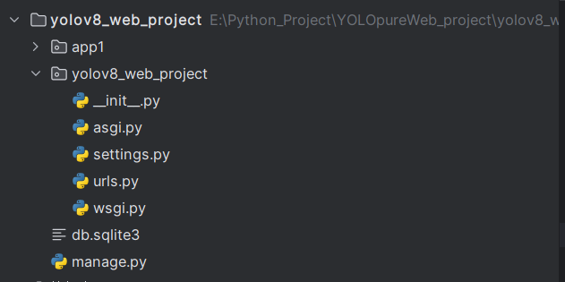
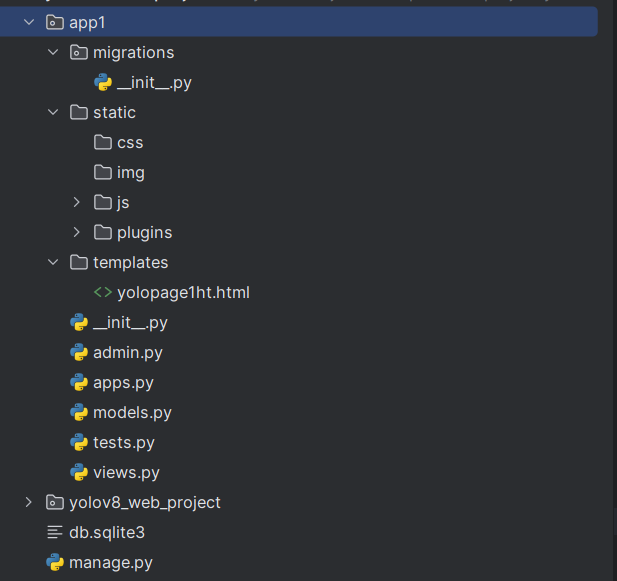
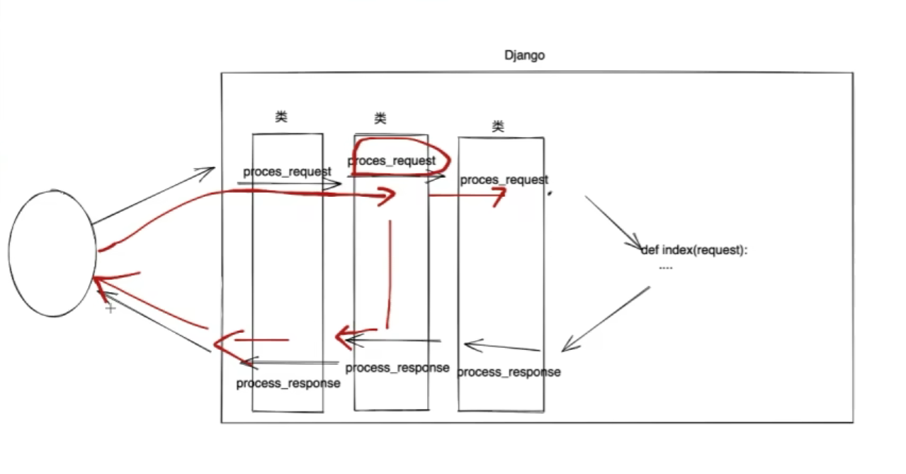
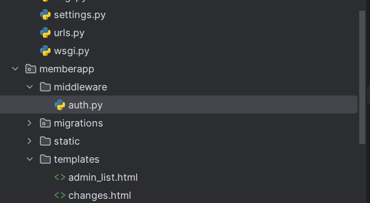

# Django Document

## 一、项目

#### 1、创建项目

- 正常方法
  1. 新建环境，`pip install Django` 下载包
  2. cmd 运行环境目录下 `Scirpts/django-admin.exe` 

- Pycharm方法

  1. 新建项目，选择Django（注意设置环境）

  2. 删除新建项目中的 `templates` 文件夹

  3. `setting.py` 中设置 `'DIRS':[ ]` 

     ```python
     TEMPLATES = [
         {
             ...
             'DIRS': []
             ...
         },
     ]
     ```


#### 2、初始项目目录




> 仅 `settings.py` 与 `urls.py` 需要配置

> `manage.py` - **执行命令文件**
> `settings.py` - **配置文件**
> `urls.py` - **urls地址文件** *（每次新建地址需新增path（））* <u>*重要</u>


#### 3、初始文件解读

##### （1）urls.py 文件配置方法

 1. import 新建app下的 `view.py` 

    ```py
    from app1 import views
    ```

 2. 新增 `path ( 'path/' , views.webdef , name = 'keyname')`

    - value1: 网站url（127.0.0.1：8000/path）
    - value2: app/views.py 中新增的网站def `def webdef` （运行该代码）
    - value3: keyname，识别用，可无

##### （2）setting.py 设置

- 连接app

- 数据库连接


---


## 二、应用

#### 1、创建app

（1）项目cmd进入manage.py同目录文件夹运行 `python manage.py startapp app1` 创建app

（2）settings.py 文件中新增app3

> ```py
> "settings.py"
> ...
> INSTALLED_APPS = [
>     'django.contrib.admin',
>     'django.contrib.auth',
>     'django.contrib.contenttypes',
>     'django.contrib.sessions',
>     'django.contrib.messages',
>     'django.contrib.staticfiles',
>     ###
>     'app1.apps.App1Config'    
>     ###新增  app1(新建app名).apps(app1文件夹下的apps.py文件).App1Config（apps.py中的函数）
> ]
> ...
> ```

（3）`app1/` 下新建`static`，`templates`文件夹，其中

- static：创建如下文件夹，分别放入静态文件
- templates：放入html文件


#### 2、app目录



> 仅`models.py`，`views.py`需要配置


#### 3、app文件解读

##### (1) models.py 文件


##### (2) views.py 文件

**<u>主要处理后端函数与编写代码区</u>**，自行创建def，"urls.py" 中调用的函数即为这里创建的def

```django
"views.py"
from django.shortcuts import render

# Create your views here.

from django.http import HttpResponse


def yolopage1def(request):
    return render(request,'yolopage1ht.html')
```


1. **(request)**

   是一个对象，封装了用户通过浏览器发送过来的所有请求相关数据

   - request.GET : 获取GET数据
   - request.POST: 获取POST数据
   - request.method: 请求方法

2. **return相关**

   (1) **HttpResponse("文本")**

   (2) **render(request , 'xxx.html' , { "title":"文本" , "xxx":xx })** *(渲染)*

   - 处理过程：

     1. 读取含有模板语法的HTML文件

     2. 内部进行渲染（根据模板语法执行并替换数据）

        > 最终得到只包含HTML标签的字符串

     3. 将渲染（替换）完成的字符串返还给用户浏览器

   (3) **redirect("href")**

3. **GET与POST相关**

   第一次打开页面时 def 的 request 会是GET请求，所以可以用过 if else 语句用 request.method 判断是GET请求或者是POST请求，若是GET请求首次 render 页面（此时后面的传值可为空），若是POST请求则处理数据后再选择 redirect 或者再 render 传值

   - request.GET/POST.get("key") : 获取key数据的单个值

   [更多请求相关](##四、请求)

4. **在 views.py 的函数中写html语句并传递进html**

   ```py
   from django.utils.safestring import mark_safe           # 注意引入包
   def pretty_list(request):
       ...
       for n in range(1,page_total+1):
       	coding = "<li class='page-item'><a class='page-link' href='?page={}'>{}</a></li>".format(n, n)
       	page_list.append(coding)
       page_code = mark_safe("".join(page_list))			# 转换形式
       return render(request, 'prtty_list.html',
                     {"pretty_list": prtty_list, "search_data": search_data, "page_code": page_code})
       
       # 在html中使用{{ page_code }}即可
   ```

   


##### (3) static 文件夹

放置静态文件，HTML在需要引用static其中内容时，需要在HTML头部增加 ``，后续地址从`href="/static/img/img1.jpg"` 变更为 `href= ""`
```django
            #增加

<!DOCTYPE html>
<html lang="en">
<head>
    <meta charset="UTF-8">
    <title>Title</title>
    <link rel="stylesheet" href="">  #地址格式切换
</head>
<body>
...
    
<script src=""></script>            #地址格式切换
<script src=""></script>     #地址格式切换
<script src=""></script>    #地址格式切换

</body>
</html>
```


>  其与代码中对应的路径修改位置为 `settings.py` 中的 `STATIC_URL = 'static/'` ，后期需要修改文件位置时只需在此处修改即可
>
> ```py
> "setting.py"
> STATIC_URL = 'static/'
> ```


---

## 三、模板语法

 Django模板语法，通过在HTML中嵌入模板语法完成动态编写网站的功能，与后端完成页面交互

#### 1、交互方法

`"view.py"` 中创建数据，通过`return render(request, 'xxx.html', { 'd1':data1 , 'd2':data2 , 'd3':data3 })`进行传输，`xxx.html`文件中通过双花括号 `{{ d1 }}` 获取数据

```python
def tpltrain(request):
    name = "小一"
    age = 10

    infor_list = [["啊啊啊",12,"GGG"],["唔唔唔",15,"FFF"],["噫噫噫",19,"CCC"]]
    infor_dict = {"name":"露露", "age":100, "sex":0}

    return render(request,'tpltrain.html',{ 'dname':name,'dage':age ,'dlist':infor_list, 'ddict':infor_dict })
```


#### 2、数据获取语法

- 单数据，HTML 中通过 {{ dname }} 获取
- 列表，HTML 中通过{{ dlist.0 }} 获取  *(从0开始)*
- 字典，HTML 中通过{{ d1.name }} 获取

*（多层包含可通过{{ dlist.0.0.name }}获取）*

> 实例:
> ```django
> <ul>
>  <li>{{ dname }}</li>
>  <li>{{ dage }}</li>
>  <li>3333</li>
>  <li>=======</li>
>  <li>{{ dlist.0.0 }}</li>
>  <li>{{ dlist.1.1 }}</li>
>  <li>{{ dlist.2.2 }}</li>
>  <li>=======</li>
>  
>  <li>{{ item.0 }}+{{ item.1 }}+{{ item.2 }}</li>
>  
>  <li>=======</li>
>  <li>{{ ddict.name }} = {{ ddict.age }}
>      
>      是楠
>      
>      是缕
>      
>  </li>
> </ul>
> ```
>
> > 注意：如果内部需要用到( )，不需自己加( )，模板语法会自动增加( )


#### 3、逻辑语法

1. 循环

   ```django
   
   <li>{{ item.0 }}+{{ item.1 }}+{{ item.2 }}</li>
   
   ```

2. 判断

   ```django
   
   是楠
   
   是缕
   
   ```


---

## 四、请求

#### 1、请求类别

- GET 请求，在url中通过 path1/path2/*<u>?n1=123&n2=444</u>* 传递数据

  > request.GET ->  <QueryDict: {'q': ['888'], 'xx': ['123'], 'bbn': ['999']}  （返回字典）
  >
  > request.GET.urlenconde( ) -> q=888&xx=123&bbn=999    （返回url中？后跟内容）

- POST 请求，隐藏传递数据

  >  "views.py" 的 def 中通过 request.method 获取该 def 的请求方法

- ajax 请求，页面不刷新

  - 依赖jQuery

  - 编写ajax代码

    ```javascript
    $.ajax({
        url: "发送的地址",
        type: "get/post",
        data:{
            n1:123,
            n2:234,
        },					# 发送的数据
        success:function(res){
        	console.log(res);	# 返回的数据
    	}
    })
    ```

    


#### 2、request 使用

> request 函数可以在HTML中使用

(1) `request.session[ 'info' ] = {'id' = 123 , 'name' = 'gogo'}`

网站随机生成字符串，写到浏览器的cookie中，再写到session中

> - .get('info')  -  返回该数据
>
> - .clear( )  -  清除当前cookie
> - .set_expiry(60)  -  session 60s超时  （注意登录进入后要重新设置session时间，如:60 * 60 * 24 *7(七天)）

(2) `request.path_info`

返回当前的URL地址，例如返回 '/login/'

(3) `request.FILES`

请求发过来的文件


#### 3、传递方法

##### (1) \<form\>方法

- HTML文件中

  创建 \<form\> 标签设置为post方法并设置好返回页面（当前页面就是action="/nowpage/"），其中 \<input\> 框中注意标识 name="key1" ，最后建立submit按钮提交表单

  > 注意在 form 中需要添加  {{ crsf_token }} 提供校验码

  ```django
  <form method="post" action="/getandpost/">
                             #注意增加
  
      <input type="text" name="user" placeholder="用户名">        #注意name="key"
      <input type="text" name="pwd" placeholder="密码">
      <input type="submit" value="提交"/>
      <span style="color: red">{{ error_text }}</span>
  </form>
  ```

  

- "views.py" 文件中

  分支为 request.method == "POST" 中，通过 request.POST 可获得全部post的数据，通过再增加 .get("key","") 可以获取单个数据其中后面的参数为未获取到时的默认返回数据

  通过数据处理后最后 return render（） 即可，详细可参考上文[views.py文件解读](#####(2) views.py 文件)

  ```python
  def getandpost(request):
      if request.method == 'GET':
          return render(request,"getandpost.html")
  
      else:
          print(request.POST)
          getname = request.POST.get("user")
          getpwd = request.POST.get("pwd")
          if getname=='123' and getpwd=='321':
              return HttpResponse("登陆成功")
          else:
              return render(request,"getandpost.html",{'error_text':"用户名或密码错误"})
  ```

##### (2) path( ) 方法 （Django方法）

- urls.py 文件中

  在 path( ) 的url地址中增加 `<int:nid>` 即可做到动态url，并且根据url上的值完成数据的传递
  （替代了通过GET方法，读取 `?nid=1` 来获取nid，更便捷）

  ```python
  "urls.py"
  ...
  path('depart/<int:nid>/edit', views.departEdit),
  ...
  
  # 网站示例 /depart/3/edit
  ```

  

- views.py 文件中

  函数需要增加形参nid，操作时此nid根据url上的nid获取值

  ```py
  "views.py"
  def departEdit(request,nid):
      depart = models.Department.objects.filter(id=nid).first()
      
  # /depart/3/edit 时，nid = 3
  ```

##### (3) Form 组件 （Django语法）

> 本质：方便建立input框，并自动进行输入框错误检测
>
> 在提交方面还是用 \<form\> 方法

- views.py 文件中

  ```python
  "views.py"
  from django import forms
  # 在函数上面创建类，继承Form
  class MyFrom(forms.Form):
      name = forms.CharField(widget=forms.Input, attrs={'class': 'form-control'})
      phone = forms.CharField(widget=forms.Input)    
      age = forms.CharField(widget=forms.Input)    
      # 显示成Input框
      
  def memberadd(request):
      if request.method == "GET":
          form = Myform()        # 实例化
          return render(request,"memberadd.html",{ "form":form })
  ```

- html 文件中

  ```Django
  "memberadd.html"
  
  <form method="post">
  # 单独方法
  {{ form.name }}
  {{ form.phone }}
  {{ form.age }}
  # 相当于: <input type="text" placeholder="name" name="user">
  
  # 循环方法
  
  	{{ field }}
  
  ```

- **使用方法**

  (1) widget= 

  - forms.TextInput ( ) : 输入框
  - forms.PasswordInput ( ) : 密码框

  

  > 字段常用属性： 
  >
  > widget
  >
  > label = "标签"  -  标签
  >
  > render_value=True  -  错误返回时不清空输入框
  >
  > required=True  -  不能为空

  (2) 添加错误信息

  在输入完提交后验证时增加，可以在指定输入框下方显示自定义的错误信息

  ```py
  form = LoginForm(data=request.POST)
  if 	form.is_valid():
      ...
      admin_obj = models.Admin.object.fliter(**form.cleaned_data).first()
      if not admin_obj:
          form.add_error("username", "用户名或密码错误")       # 左边为显示位置输入框下方，右边为自定义信息
          return render(...)
  ```

  

##### (4) ModelForm 组件 （Django语法, 针对数据库的某个表的增加编辑管理）

> 本质：方便建立input框，并自动进行输入框错误检测
>
> 在提交方面还是用 \<form\> 方法

- models.py 文件中

  ```python
  # 不变，作参考
  class Member(models.Model):
      gender_list = (
          (1, "男"),
          (2, "女")
      )
  
      name = models.CharField(verbose_name="名字",max_length=16)
      phone = models.CharField(verbose_name="手机号",max_length=32)
      pwd = models.CharField(verbose_name="密码",max_length=32)
      age = models.IntegerField(verbose_name="年龄")
      account = models.DecimalField(verbose_name="余额",max_digits=10,decimal_places=2,default=0)
      create_time = models.DateTimeField(verbose_name="入职时间",null=True,blank=True)
  
      depart = models.ForeignKey(verbose_name="部门",to="Department",to_field="id",null=True,blank=True,on_delete=models.SET_NULL)
      gender = models.SmallIntegerField(verbose_name="性别",choices=gender_list)
  ```

  

- views.py 文件中（唯一改变处）

  ```python
  "views.py"
  from django import forms
  # 在函数上面创建类，继承Form
  class MyFrom(forms.ModelForm):
  ############ 唯一改变处 ##############
  	xx = form.CharField("...")
      class Meta:
      	model = models.Member # models.py文件中的类名
          fields = ["name","phone","pwd","xx"]
          # fields = "__all__"     所有自定义字段
          # exclude ['level']      除了level
  ############ 唯一改变处 ##############
      
  def memberadd(request):
      if request.method == "GET":
          form = Myform()        # 实例化
          return render(request,"memberadd.html",{ "form":form })
      
      ######### 增加 #########
      form = MemberForm(data=request.POST)    # data属性获取QuerySet类型数据
      if form.is_valid():       # 错误检测
          form.save()           # 保存数据到数据库
          return redirect('/member/list/')
  
      return render(request, 'memberadd.html', {"form": form})   # 返回错误信息，此处 field.errors 会出现
  	######### 增加 #########
      
      ######### 编辑 #########
      row_obj = models.Member.object.filter(id = nid).first()
      if request.method == "GET":
      	form = MemberForm(instance = row_obj)         # instance属性获取object类型数据
      	return render(request,"memberadd.html",{ "form":form })
      
      form = MemberForm(data=request.POST, instance=row_obj)     # instance属性链接表上的那一行数据进行修改
      if form.is_valid():
          # 默认保存的是用户输入的所有数据，如果想要在用户输入以外增加一点值
          # form.instance.字段名 = 值
          form.save()
          return redirect('/member/list/')
  
      return render(request, 'memberedit.html', {"form": form})
      ######### 编辑 #########
  ```

- html 文件中

  ```Django
  "memberadd.html"
  
  <form method="post">
  # 单独方法
  {{ form.name }}
  {{ form.phone }}
  {{ form.age }}
  # 相当于: <input type="text" placeholder="name" name="user">
  
  # 循环方法
  
  	{{ field }}
  
  ```

  

- ##### 使用方法

  1. 标签

     `{{ form.xxx.label }}`

     ```django
     {{ form.name.label }} : {{ form.name }}
     <!-- 效果：获取models中定义的 verbose_name 注释名 -->
     ```

  2. 样式

     - 方法一：

       在 `class Meta:` 中增加 widget 属性，为每个框增加样式

       ```python
       "views.py"
       
       class MyFrom(forms.ModelForm):
       	xx = form.CharField("...")
           class Meta:
           	model = models.Member 
               fields = ["name","phone","pwd","xx"]
               
               # 增加 form-control 样式
               widget = {
                   "name" : forms.TextInput(attrs={"class":"form-control"})
                   "phone" : forms.TextInput(attrs={"class":"form-control"})
                   "pwd" : forms.TextInput(attrs={"class":"form-control"})
                   ...
               }
       ```

     - 方法二：

       改源码，做循环为每个输入框增加同一个样式，另外可以通过if判定进行continue则跳过该输入框的循环增加或者单独增加样式

       ```py
       "views.py"
       
       class MyFrom(forms.ModelForm):
       	xx = form.CharField("...")
           class Meta:
           	model = models.Member 
               fields = ["name","phone","pwd","xx"]
               
               # 循环增加 form-control 样式
           def __init__(self,*args,**kwargs):
               super().__init__(*args,**kwargs)
               for name,field in self.fileds.items():
               	if name == "pwd"
                   	continue       #跳过pwd输入框样式添加
              		field.widget.attrs = {"class":"form-control","placeholder": field.label} 
                   # 循环增加
       ```

     - 方法三：
  
       新建字段时增加widget属性, 在属性中增加 attrs={'class': 'form-control'}
  
       ```python
       class AdminForm(BootstrapModelForm):
           confirm_pwd = forms.CharField(label='确认密码', widget=forms.PasswordInput(attrs={'class': 'form-control'}))
       
           class Meta:
               model = models.Admin
               fields = ['name', 'pwd', 'confirm_pwd']
               widgets = {
                   'pwd': forms.PasswordInput()
               }
       ```
  
       
  
  3. 错误
  
     {{ fields.errors.0 }} , 返回的错误是一个列表，只取第一个错误
  
     ```django
     "HTML"
     <span style="color: red">{{ field.errors.0 }}</span>
     ```
  
     > 改为中文错误信息： "setting.py" 文件中将 LANGUAGE_CODE = 'en-us' 改为 'zh-hans'
     >
     > ```py
     > LANGUAGE_CODE = 'zh-hans'  # 'en-us'为英文
     > ```
     >
  
  4. 增加检验规则（钩子方法）
  
     在 class ModelForm: 中重新定义数据类可以为新增数据列时的输入框增加验证规则，可以验证输入并自定义返回错误的信息
  
     注意 .cleaned_data 返回所有返回输入数据的字典
  
     ```python
     from django.core.validators import RegexValidator
     from django.core.exceptions import ValidationError
     
     ################## 方法一 ###################
     class PrettyForm(forms.ModelForm):
         mobile = forms.CharField(
             lable = "手机号",
             validators = [RegexValidator(r'^1[3-9]\d{9}$', "手机号格式错误", "错误信息2")],
         )
     ################## 方法一 ###################
         
         class Meta:
             ...
         
         def __init__(...):...
         
         
     ################## 方法二 ################### 钩子方法
     	# clean_后面必须跟检验字段的名称
         def clean_mobile(self):
        		txt_mobile = self.cleaned_data['mobile']
             exists = models.PrettyNum.object.exclude(id=self.instance.pk).filter(mobile=txt_mobile).exists()
             if exists:
                 raise ValidationError("号码已存在")
             return txt_mobile
     
     #        
     #       if len(txt_mobile) != 11:
     #            raise ValidationError("格式错误")
                 
     #        return txt_mobile
     ################## 方法二 ###################
     ```
  
     > `r'^正则表达式内容&'`，此处的正则表达式意义为 1+（3-9）任意一个数字+9个数字 
     >
     > `self.cleaned_data['字段']` 获取输入框的字段并可以返回
     > `self.cleaned_data.pop('字段')` 获取并删除该字段，一半用于与session检测时的临时数据剔除
     >
     > `self.instance.pk` 获取instance输入对象的primarykey，一般为id
  
  5. 继承
  
     utils文件夹中新建 BootstrapModelForm.py 文件，新建父类将 \_\_init\_\_ 放入，后续可直接继承该模板
  
     ```py
     from django import forms
     
     
     class BootstrapModelForm(forms.ModelForm):
         def __init__(self, *args, **kwargs):
             super().__init__(*args, **kwargs)
             for name, field in self.fields.items():
                 if field.widget.attrs:
                     field.widget.attrs['class'] = 'form-control'
                     field.widget.attrs['placeholder'] = field.label
                 else:
                     field.widget.attrs = {'class': 'form-control', 'placeholder': field.label}
     ```
  
     


---

## 五、数据库

### 1、基于pymysql数据库操作

- MySQL数据库 + pymysql

  ```python
  import pymysql
  
  # 1.连接MySQL
  conn = pymysql.connect(host="127.0.0.1", port=3306, user='root'),
  passwd = "root123", charset='utf8', db='unicom'
  cursor = conn.cursor(cursor = pymysql.cursors.DictCursor)
  
  # 2.发送指令
  cursor.execute("insert into admin(username,password,mobile) values('nick','qwe123','12222222222')")
  conn.commit()
  
  # 3.关闭
  cursor.close()
  conn.close()
  ```

  

### 2、基于Django数据库操作（ORM框架）

>  ORM可以：
>
> - 创建、修改、删除数据库中的表（不用写SQL语句） 【无法创建数据库】
> - 操作表中的数据（不用写SQL语句）

#### 1. 配置MySQL连接

(1) 安装 mysqlclient 包，并自行创建数据库 (示例：djangotest)

```python
pip install mysqlclient
```

(2) "settings.py" 中设置mysql数据库连接 (注意前面已[注册app](####1、创建app))

```py
"settings.py"
DATABASES = {
    'default': {
        "ENGINE": "django.db.backends.mysql",
        "NAME": "djangotest",
        "USER": "root",
        "PASSWORD": "123456",
        "HOST": "127.0.0.1",
        "PORT": "3306",
    }
}
```

#### 2. 创建表

(1) "models.py" 中编辑要建立的表

```python
class member(models.Model):
    """ 人员表 """
    # 自动添加：
    # id = models.BigAutoField(verbose_name="ID", primary_key=True)
    name = models.CharField(verbose_name="名字", max_length=32)
    phone = models.CharField(verbose_name="电话", max_length=64)
    age = models.IntegerField(verbose_name="年龄", )
# Create your models here.

"""  相当于
CREATE TABLE app1_member(
    id bigint auto_increment primary key,    (会默认添加自动增加的id key值)
    name varchr(32),
    phone varchar(64),
    age int
)
"""
```

- 通用参数：
  - max_length=32 : 最长度为32
  - default=2 : 默认为2
  - null=True, Blank=True : 可为空 
  - verbose_name="注释" : 注释

- 数据类型：

  - DecimalField(max_digits=10, decimal_places=2) : 最大长度为10，小数后2位
  - DateTimeField( ) : 时间，从数据库读取时间时为datetime类型，使用 `.strftime("%Y-%m-%d-%H-%M")` 转化为字符串，如果是在HTML文件中的模板语法，使用 `{{ obj.create_time|date:"Y-m-d H:i:s" }}`
  - DateField( ) : 时间，但只有年月日

- 约束：

  1. 外键约束

     ```py
     # 与 Department表 中的 id 联结
     depart = models.ForeignKey(to="Department", to_filed="id", on_delete=models.CASCADE)
     ```

     > on_delete : 
     >
     > - models.CASCADE 时删除D表中数据，原表与其关联id的数据也会被整行删除
     > - models.SET_NULL 会设置为空（注意数据也要设置为可以为空）
     >
     > 在数据库中建立的数据名为 `depart_id` 
     > 调用数据时采用 `obj.depart_id` 返还数字，但 `obj.depart` 会返回id关联表一行的对象, 在增加 `.name`(例) 即可获取关联数据
  
     > 在HTML中要输出所有的数据（如做部门的选项组），可以在 views.py 中建立context，传入render中即可
     >
     > ```py
     > "views.py"
     > def user_add(request):
     >     context = {
     >         'gender_list': models.member.gender_list,
     >         "depart_list": models.Department.object.all(),
     >     }
     > ```
     >
     > 
  
  2. django约束
  
     增加参数 choices = gender_choices （gender_choices为建立的关系对应表）
  
     ```py
     class UserInfo(models.Model):
         gender_choices = (
             (1,"男"),
             (2,"女"),
         )
         ...
         gender = models.SmallIntegerField(verbose_name="性别", choices=gender_choices)
         ...
     ```
  
     > 数据库中存储的为数字，需要从数据库中获取对应值时从 obj.gender -> obj.get_gender_dispaly( )
     > 格式：.get\_字段名称\_dispaly( )
     
     > 在HTML中要输出所有的数据（如做部门的选项组），可以在 views.py 中建立context，传入render中即可
     >
     > ```py
     > "views.py"
     > def user_add(request):
     >     context = {
     >         'gender_list': models.member.gender_list
     >         "depart_list": models.Department.object.all(),
     >     }
     > ```
     >
     > 

(2) cmd启动 "manage.py" 创建表

```cmd
python manage.py makemigrations   #一步
python manage.py migrate		  #二步
```

> 每次要新建表或者修改表头时只需要在 "models.py" 中 增减Class/增减实例 再运行以上两行代码即可


#### 3. 数据操作

首先需要在使用的文件(即 "views.py")中 import "models.py"文件

##### （1）增加数据

```python
# 新建数据
models.member.objects.create(name="大大", phone="12395832473", age=21)
models.member.objects.create(name="妮妮", phone="12323572473", age=25)
models.member.objects.create(name="破破", phone="12113463273", age=18)
```

> 可不全

##### （2）选择数据

```python
# 选择数据
data_list = models.member.objects.all()               # 选择全部
datammm = models.member.objects.filter(id=1).first()  # 选择单个,最后.first()则不会输出QuertSet类型


for data in data_list:
    print(data.id, data.name, data.phone, data.age)
    
print(datammm.id, datammm.name, datammm.phone, datammm.age)
```

> **filter专项**
>
> ```py
> # 正常情况下返回的数据为对象，如果增加.values()，则返回的数据为dict字典，增加.values_list()返回元组
> models.PrettyNum.objects.all()    							#[ obj, obj, obj, ...]
> models.PrettyNum.objects.all().values("id","mobile")    	#[{"id":xxx,"mobile":xxx}, {..}, ...]
> models.PrettyNum.objects.all().values_list("id","mobile")   #[(1,"xx"), (2,"xxx"), ...]
> 
> data_dict = {
>  "mobile": 12312312312,
>  "id": 123
> }
> models.PrettyNum.objects.filter(**data_dict)  	# 多条件时可以增加逗号，也可引入字典, 空字典表示所有
> 
> # 大于小于
> models.PrettyNum.objects.filter(id=12)			# 等于12
> models.PrettyNum.objects.filter(id__gt=12)		# 大于12
> models.PrettyNum.objects.filter(id__gte=12)		# 大于等于12
> models.PrettyNum.objects.filter(id__lt=12)		# 小于12
> models.PrettyNum.objects.filter(id__lte=12)		# 小于等于12
> data_dict = {"id_lte":12}
> models.PrettyNum.objects.filter(**data_dict)
> 
> # 字符串部分匹配
> models.PrettyNum.objects.filter(mobile="999")				# 等于
> models.PrettyNum.objects.filter(mobile_startswith="999")	# 以999开头	
> models.PrettyNum.objects.filter(mobile_endswith="999")		# 以999结尾
> models.PrettyNum.objects.filter(mobile_contains="999")		# 包含999
> data_dict = {"mobile_contains":999}
> models.PrettyNum.objects.filter(**data_dict)
> 
> # 多个  （左闭右开区间）
> models.PrettyNum.objects.all()[0:10]		`	# 前十条
> models.PrettyNum.objects.filter()[10:20]		# 接下来十条
> ```
>
> 

> - 选择多个数据时返回的是 QuerySet 类型 （ 对象列表，如：[对象，对象，对象] ）
> - .filter(id= 1) 根据条件查找单个数据最后可加 `.first()` 以返回对象  
> - 增加 .order_by( ) 可以进行排序 , 其中 ( 列名 ) 是asc排列 , ( - 列名 ) 是desc排列
> - 增加 .exclude(id=nid) 可以排除某个数据再搜索
> - 增加 .exists( ) 可以搜索是否存在，存在返回True
> - 增加 .count( ) 数据量 

##### （3）删除数据

原理：先选择，再增加 .delete() 完成删除

```python
# 删除数据
models.department.objects.filter(id=3).delete()
```

（4）更新数据

原理：先选择，再增加.update(name = "新名字", age = "新年龄", ...)

```python
# 修改数据
models.member.objects.filter(name="妮妮").update(age=15)
```

> 选择 `.all()` 则是全部修改


---

## 六、模板继承

Django可以提供模板继承功能大幅度减少重复html文件的编写，可以将导入的css，js等插件包以及导航栏定义为模板，在编写其他网页时只用继承该模板即可

- layout.html 母版文件

```django
"layout.html"

<!DOCTYPE html>
<html lang="en">
<head>
    <meta charset="UTF-8">
    <title>部门列表</title>
    <link rel="stylesheet" href="">
                   # 编写区块
    	                          # 编写区块
	                # 编写区块
    <style>
        .ac_sm_btn {
            --bs-btn-padding-y: .25rem;
            --bs-btn-padding-x: .5rem;
            --bs-btn-font-size: .8rem;
        }
    </style>

</head>
<body>

<nav class="navbar navbar-expand-lg bg-body-tertiary"...>
    
<div>
    <div class="container" style="margin-top: 1rem">
                      # 编写区块
                                         # 编写区块
                           # 编写区块
    </div>
</div>

                # 编写区块
                              # 编写区块
                # 编写区块
    
<script src=""></script>
<script src=""></script>
<script src=""></script>
</body>
</html>
```

> 区块格式：
>                    
>
> 可以多用区块，如css和js也可再增加区块


- 继承母版的html

```django
                  #导入母版







<h1> 首页 </h1>
<h2> 内容 </h2>
<h3> 结尾 </h3>






```


---

## 七、文件分类

如果 "views.py" 文件较大可以将其拆分

- class Form -> app01/utils/form.py
- def -> app01/views/aaa.py

> 拆分完注意删除 views.py 文件并调整好 urls.py 文件中的import


---

## 八、中间件



#### 1、创建中间件

(1) **定义中间件**

在app01中船舰middleware文件夹，内部再创建py文件import需要的包，在内部新建继承类编写中间件内容



```py
from django.utils.deprecation import MiddlewareMixin


class M1(MiddlewareMixin):

    # 如果request没有返回值（返回None），继续往前走
    # 如果有返回值 HttpResponse、render、redirect，则不再继续向后执行
    def process_request(self, request):
        print("中间1,进入")

    def process_response(self, request, response):
        print("中间1，退出")
        return response


class M2(MiddlewareMixin):
    def process_request(self, request):
        print("中间2,进入")

    def process_response(self, request, response):
        print("中间2，退出")
        return response
    
# 示例：用户cookie监测
class AuthMiddleware(MiddlewareMixin):

    def process_request(self, request):
        if request.path_info == '/login/':
            return

        info_dict = request.session.get('info')
        print(info_dict)
        if not info_dict:
            return redirect('/login/')
        return

    def process_response(self, request, response):
        return response

```

> 注意 response 函数一定需要return，request 可以不用return


(2) **应用中间件**

在 settings.py 文件中注册中间件

```py
MIDDLEWARE = [
    'django.middleware.security.SecurityMiddleware',
    'django.contrib.sessions.middleware.SessionMiddleware',
    'django.middleware.common.CommonMiddleware',
    'django.middleware.csrf.CsrfViewMiddleware',
    'django.contrib.auth.middleware.AuthenticationMiddleware',
    'django.contrib.messages.middleware.MessageMiddleware',
    'django.middleware.clickjacking.XFrameOptionsMiddleware',
    'memberapp.middleware.auth.M1',
    'memberapp.middleware.auth.M2',
]
```


---

## 九、Ajax请求

#### 1、GET请求

```django
<input type="button" class="btn btn-primary" value="点 击" onclick="clikeme();">
<script type="text/javascript">
    // doom方法
    function clikeme(){
        $.ajax({
            url: "/task/ajax/",
            type: "get",
            data: {
                n1: 123,
                n2: 234,
            },
            success: function(res){
                console.log(res);
            }
        })
    }

    // jQuery方法
    $(function () {
        // 页面框架加载完成后代码自动执行
        bindBtn1Event();
    })

    function bindBtn1Event() {
        $('#btn1').click(function () {
            $.ajax({
                url: "/task/ajax/",
                type: "get",
                data: {
                    n1: 123,
                    n2: 234,
                },
                success: function (res) {
                    console.log(res);
                }
            })
        })
    }
</script>
```

```python
def task_ajax(request):
    if request.method == 'GET':
        print(request.GET)
    return HttpResponse('点击了ajax')
```

#### 2、POST请求

需要通过csrf验证，此处可直接在views函数中免除csrf验证

```python
from django.views.decorators.csrf import csrf_exempt

@csrf_exempt
def task_ajax(request):
    print(request.POST)
    return HttpResponse("成功了")
```

#### 3、Ajax返回值

Ajax请求一般返回JSON格式，需要在渲染函数中将处理与需要传递的数据转为JSON格式，在html提取时需要转为dict格式。

```python
def task_ajax(request):
    if request.method == 'GET':
        print(request.GET)
        data_dict = {'status': True, 'data': [1, 1, 2, 2]}
        return HttpResponse(json.dumps(data_dict))			# 转字典为JSON
    # 或者return JsonResponse(dict)						  # 简单 可用
```

```Django
<script type="text/javascript">
    $(function () {
        // 页面框架加载完成后代码自动执行
        bindBtn1Event();
    })

    function bindBtn1Event() {
        $('#btn1').click(function () {
            $.ajax({
                url: "/task/ajax/",
                type: "get",
                data: {
                    n1: 123,
                    n2: 234,
                },
                dataType: "JSON",				// 转接收的JSON字符串为对象
                success: function (res) {
                    console.log(res);
                    console.log(res.status);	// res获取的为对象，如果没有dataType则为字符串
                    console.log(res.data);
                }
            })
        })
    }
</script>
```


#### 4、传递数据的方法

##### （1）选取标签

- 标签选取： `$("tr")`   不加前缀选取所有\<tr\>标签
- 选中含有某属性的标签：`$("tr[uid='123']")`   通过[ ]选取指定属性的指定标签
- id选取： `$("#id_tag")`   通过#指定id
- class选取： `$(".class_tag")`   通过. 指定class
- 标签tag合并： `$("#id_" + name)`  直接通过 + 字符串  来进行id的合并


##### （2）常用标签操作

- `.text("输入内容")`  :  为标签增加内容，即将"输入内容"插入再开始标签和结束标签中间的白字处
- `.empty( )`  :  清空中间白字
- `.remove( )`  :  删除该标签

data: 中，如果要将input输入框中的数据传入方法有

- `$("#id_text_input").val( )`  -  取对应输入框的id，获取输入框中的值，需要输入框中有id属性，( )内有值则是为该input赋值value属性
- `$("#id_form").serialize( )`  -  取输入框集合form的id，自动获取form中所有input框中的数据，input框不需要id属性但需要name属性作为自动生成字典的key，form需要有id属性

```javascript
data: {
	user: $("#txtuser").val(),
	age: $("#txtage").val(),
},

data: $("#form3").serialize(),
```


##### （3）常用函数

- 循环语句

  ```javascript
  $.each(dict, function(key, data){
      """ 循环体 """
  })
  ```

- 判断语句

  ```javascript
  if (bool){
  
  }
  else{
  
  }
  ```

  

- 弹窗

  ```javascript
  alert("添加成功")
  ```

  


#### 5、ajax和modelform

使用ajax和modelform结合完成无刷新的新增数据

向ajax的url发送所有表数据后，在指定url的函数中完成 is_vaild 判断与 .save() 的操作，返回错误信息时使用 form.errors , 在 .ajax 中分别判断创建成功与输入错误的情况进行处理。

再使用$选取标签进行值的增加删除

```python
@csrf_exempt
def task_add(request):
    print(request.POST)
    form = TaskForm(request.POST)
    if form.is_valid():
        form.save()
        data_dict = {'status': True}
    else:
        data_dict = {'status': False, 'error': form.errors}

    return HttpResponse(json.dumps(data_dict))
```

```javascript
function taskBtnEvent() {
    $("#task_btn").click(function(){
        $(".error-msg").empty()
        $.ajax({
            url: '/task/add/',
            type: "post",
            data: $("#task_form").serialize(),
            dataType: "JSON",
            success: function (res){
                if(res.status){
                    alert("添加成功");
                    // 删除表格内信息
                    // $("#task_form")[0].reset  (清空form表单内容)
                    location.reload();	
                }
                else {
                    $.each(res.error,function (name, data){
                        $("#id_" + name).next().text(data)
                    })
                }

            }
        })
    })
}
```

> `$("id_form")` 为jQuery对象，加上`[0]`为DOM对象，`.reset`是DOM方法

#### 6、弹窗（Modal）

- 方法一：

  按钮中增加属性 `data-bs-toggle="modal" data-bs-target="#exampleModal"` 
  data-bs-target 为弹窗面板id

  ```django
  <button type="button" class="btn btn-primary" data-bs-toggle="modal" data-bs-target="#exampleModal">
      
  <!-- Modal -->
  <div class="modal fade" id="exampleModal" tabindex="-1" aria-labelledby="exampleModalLabel" aria-hidden="true">
    <div class="modal-dialog">
      <div class="modal-content">
        <div class="modal-header">
          <h1 class="modal-title fs-5" id="exampleModalLabel">Modal title</h1>
          <button type="button" class="btn-close" data-bs-dismiss="modal" aria-label="Close"></button>
        </div>
        <div class="modal-body">
          ...
        </div>
        <div class="modal-footer">
          <button type="button" class="btn btn-secondary" data-bs-dismiss="modal">Close</button>
          <button type="button" class="btn btn-primary">Save changes</button>
        </div>
      </div>
    </div>
  </div>
  ```

- 方法二：

  ajax方法，为按钮添加js操作，显示modal。

  ```django
  <script type="text/javascript">
          $(function () {
              BindBtnModal1();
          })
  
  
          function BindBtnModal1() {
              $("#modal_btn").click(function () {     // 按钮ID
                  $("#exampleModal").modal('show');	// 弹窗ID
              })
          }
  
  
      </script>
  ```

  > .modal:
  >
  > - ('show')  -  打开弹窗
  > - ('hide')  -  关闭弹窗

#### 7、全局变量

在 `<script>` 中可以添加一个全局变量，在进行js操作时可以为该变量赋值或者调用这个值 

```javascript
<script type="text/javascript">
	var DELETE_ID				// 1.定义全局变量
    
    $(function () {
    BindBtnDeleteModalEvent();
	})

	function BindBtnDeleteModalEvent() {
    	$(".btn_delete").click(function () {
        	$("#deleteModal").modal('show')
            DELETE_ID = $(this).attr("uid")		// 2.为全局变量赋值（获取btn_delete标签中的uid属性的值）
            console.log(DELETE_ID)
    	})
	}

</script>
```


---

## 十、ECHARTS图表

> [ECHARTS文档](https://echarts.apache.org/examples/zh/index.html) 获取图表的详细配置方法与图表的模板

#### 1、新建图表

1. 引用 echarts.js 文件

   ```django
   <script src=""></script>
   ```

2. 创建div放置图表，注意设置id与大小

   ```django
   <div id='charts_1' style="width: 100%; height: 25rem"></div>
   ```

3. 在js中增加控制

   ```django
   <script type="text/javascript">
       // 基于准备好的dom，初始化echarts实例
       var myChart = echarts.init(document.getElementById('charts_1'));		// 切换id
   
       ////////////////   主要编辑项目option    /////////////////
       // 指定图表的配置项和数据
       var option = {
           title: {
               text: 'ECharts 入门示例'
           },
           tooltip: {},
           legend: {
               data: ['销量']
           },
           xAxis: {
               data: ['衬衫', '羊毛衫', '雪纺衫', '裤子', '高跟鞋', '袜子']
           },
           yAxis: {},
           series: [
               {
                   name: '销量',
                   type: 'bar',
                   data: [5, 20, 36, 10, 10, 20]
               }
           ]
       };
   
       // 使用刚指定的配置项和数据显示图表。
       myChart.setOption(option);
   </script>
   ```

4. 配置 option

   在文档中可以查看配置信息

#### 2、柱状图属性

1. title：

   ```javascript
   title:{
       text: '标题'
       //居中//
       textAlign: 'auto',
       left: 'center',
       //居中//
   }
   ```

   

2. legend：

​	增加 bottom：0   -   将标签设置再底下


---

## 十一、文件上传

#### 1、基础操作

在form表单中用post方法传递数据，其中form标签需要加入enctype="multipart/form-data"属性

```django
<form method="post" enctype="multipart/form-data">
    
    <input type="text" name="username">
    <input type="file" name="avatar">
    <input type="submit" value="提交">
</form>
```

```py
# 'username': ['gogogo']
print(request.POST)

# {'avatar':[<InMemoryUploadedFile: 舞头2.png (image/png)>]}    // 文件对象
print(request.FILES)
file_obj = request.FILES
return HttpResponse('ggg')
```

- 保存文件到本地

  ```python
  file_obj = request.FILES.get('avatar')	// 创建文件对象
  
  f = open(file_obj.name, mode='wb')		// 创建一个名字为 file_obj.name 的文件
  for chunk in file_obj.chunks():			// 循环 file_obj 的每一块，一块一块的放入刚才创建的文件中
      f.write(chunk)		// 写入
  f.close()				//关闭
  
  return HttpResponse('ggg')
  ```

  > file_obj 文件对象操作:
  >
  > - .name  :  获取文件名
  > - .chunks( )  :  文件分块

  > 本地文件操作:
  >
  > - f = open("name.xxx", mode = 'wb')  :  打开 name.xxx 文件，无则创建
  > - f.write( )  :  写入
  > - f.close( )  :  关闭文件
