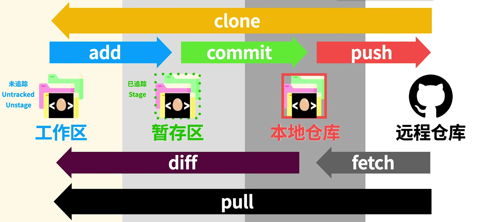

# Git Document

## 一、Git 工作流




## 二、用户设置

#### 1、设置用户名

- `git config`

```cmd
git config --global user.name "Aria sans"
```

> 用户名中有空格需要用" "包裹

#### 2、设置邮箱

- `git config`

```cmd
git config --global user.email 465441650@qq.com
```


## 三、初始化项目

#### 1、本地从零创建方法 (init)

需要告诉 Git 这个文件夹需要版本控制 

- `git init`

```cmd
git init
```

#### 2、github克隆方法 (clone)

`git clone https://github地址.git`

从github中克隆文件，克隆下来包括版本控制信息

```cmd
git clone https://github.com/AriaSans/Git-Test1.git
```

> 注意如果出现错误，则可能是开着代理，需要关闭代理并重启git窗口，或者设置git中的代理端口


## 四、文件操作

#### 0、创建文件

echo ：创建文件

"版本1" ： 文件添加的内容

lao1.md ： 文件名

```cmd
echo "版本1" > lao1.md
```


#### 1、添加到缓存区 (add)

`git add 文件.xxx`

```cmd
git add lao1.md
```

将文件放入本地的暂存区，标记为追踪


#### 2、提交到本地仓库 (commit)

- `git commit`

- `git commit -m "输入版本信息"`

```cmd
git commit						// 进入vim界面进行版本信息的编辑
git commit -m "输入版本信息"		// -m,不进入vim界面，适合简短的版本信息编辑
git commit -a -m "删库跑路"		 // -a,不用执行add操作直接提交，添加文件的话还是需要先add再commit, 可以直接写成 -am
```

将暂存区的文件全部放入本地仓库

此时会跳转到vim界面

##### VIM操作：

（1）输入 `i` 进入编辑模式

（2）编辑内容

（3）点击 esc 退出编辑模式

（4）输入 `:wq` 退出 vim 界面


#### 3、忽略文件 (.gitignore)

(1) `touch .gitignore`

创建忽略列表文件 .gitignore

```cmd
touch .gitignore
```

(2) 在 ".gitignore" 文件中输入想要忽略的文件名.后缀

```txt
".gitignore"
线稿4长.jpeg
```


#### 4、提交到远程仓库 (push)

`git push`

将版本信息与保存控制的文件上传入远程仓库（如github）中

```cmd
git push
```

> 需要输入用户名，密码输入在github中生成的tokens
>
> 位于 Settings -> Developer settings -> Personal access tokens -> Tokens(classic)


#### 5、从远程仓库更新到本地工作区 (fetch, diff, pull)

远程仓库更新后，将远程仓库更新后的内容更新到本地工作区

(1) `git fetch`

先把远程仓库更新信息存入本地版本控制仓库

```cmd
git fetch
```

(2) `git diff origin/main`

查看更新的区别

```cmd
git diff orgin/main
```

(3) `git pull`

将本地版本控制仓库更新的内容传入到本地工作区

```cmd
git pull
```


## 五、分支相关

#### 1、创建分支(branch)

`git branch 分支名`

创建新分支

```cmd
git branch branchgo1                  // 创建分支 branchgo1
git branch							  // 查看分支列表

git checkout -b branchgo1			  // 创建并且马上切换到新分支
```


#### 2、切换分支(checkout)

`git checkout 分支名`

切换到其他分支，文件直接从master主支复制

```cmd
git checkout branchgo1
```


#### 3、删除分支

`git branch -d/-D 分支名`

删除分支，-D为强制删除

```cmd
git branch -d branchgo1
git branch -D branchgo1
```


#### 4、合并分支

git merge "要合并的分支"

在要合并到的分支下，输入该指令将要合并进入的分支合并到当前的分支

```cmd
(master)分支下合并 temp 分支
git merge temp						// temp和master汇为一支
```

> 如果合并前master比分出temp分支的版本点又写了一个内容，在temp分支中是没有的，则会出现错误


## 六、Git相关功能指令

#### 1、查看当前状态(status, log)

##### I.`git status`

查看当前的文件存储处理状态

```cmd
git status
```


(1) On branch master  :  在分支 master 中

(2) 未追踪的文件

> 遗忘步骤时可以使用该代码查看提示

##### II. `git log`

查看储存的前面版本

```cmd
git log
```


#### 2、查看关联了哪些远程仓库

`git remote -v`

获取该 .git 与哪些远程仓库链接了(如github)

```cmd
git remote -v
```


#### 3、查看本地仓库和远程仓库的区别

`git diff 远程仓库名/分支名`

查看远程仓库和本地仓库的区别，一般用在 `git fetch` 把远程仓库爬取到本地仓库在 `git pull` 前做的校验

其中远程仓库名由 `git remote -v` 确认，一般为 origin

```cmd
git diff origin/main
```


## 七、常见问题

### 1、clone，push，pull 时出现了 `Failed to connect to github.com port 443 after 21090`

本地代理或DNS解析出问题，在本机一般是小蓝猫问题

#### 解决方法一：排查代理问题

##### 1、尝试重置代理或者取消代理的方式

```cmd 
git config --global --unset http.proxy
git config --global --unset https.proxy
```

如果没效果，接着往下试。

##### 2、添加全局代理

```cmd
git config --global http.proxy
git config --global https.proxy
```

如果以上问题还未得到解决，可能不是代理的问题，或许是DNS解析，再采用接下来的方法尝试。


#### 解决方法二：排查DNS解析问题

> 提示：在DNS解析前先会尝试走hosts然后在找不到的的情况下再DNS解析,修改[hosts文件](https://so.csdn.net/so/search?q=hosts文件&spm=1001.2101.3001.7020)域名解析就会先走hosts中的ip和域名的映射关系。

我们可以修改hosts文件，修改ip地址和域名的映射关系，步骤如下：

##### 1、第一步：查找github.com对应的IP

首先通过网址[ipaddress.com](https://www.ipaddress.com/)搜索框输入github.com，查找github.com对应的IP地址：


结果页面拉到最下边会看到如下信息：140.82.113.3 即查到的github.com的IP地址：


##### 2、第二步：修改hosts文件

其次找到本机的hosts文件，将查询到的GitHub IP地址内容`140.82.113.3 github.com` 追加进hosts文件：

```ini
##
# Host Database
#
# localhost is used to configure the loopback interface
# when the system is booting.  Do not change this entry.
##
127.0.0.1	localhost
255.255.255.255	broadcasthost
::1             localhost
199.232.4.133 raw.githubusercontent.com
# Added by Docker Desktop
# To allow the same kube context to work on the host and the container:
127.0.0.1 kubernetes.docker.internal
# End of section
127.0.0.1 eureka7002.com
127.0.0.1 eureka7001.com
10.10.255.120 hbygj-admin.hrhbbx.com 

140.82.113.3 github.com
```

> 提示：
> Windows大概在C:\Windows\System32\drivers\etc下
> Mac在/etc下，打开访达后,在键盘上按Shift+Command+G组合键，在窗口中输入/etc/hosts ，即可到达hosts文件的所在位置