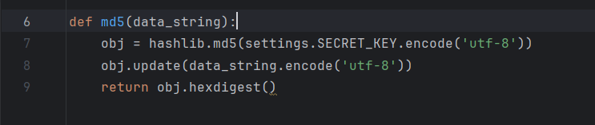
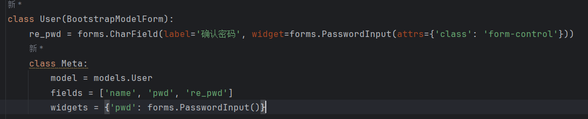
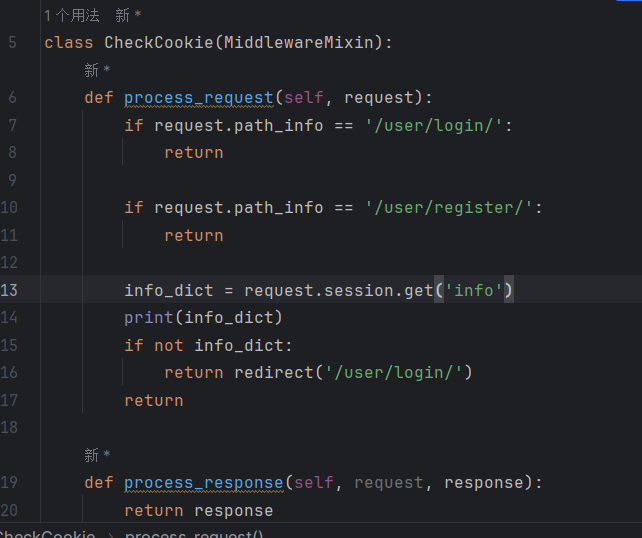

数据：

session：{'uid': 用户的id, 'name': 用户的名字}

## Date: 24-4-4

1. 表设计
   - User表
   - DetectSet表
   - OriginImg表
2. 


## Date: 24-4-5

1. 用户登录/注册

   - 用户注册界面

     1. 确认密码，密码使用md5加密，创建简单的函数进行了封装，函数效果为传入字符串并返回该字符串的md5加密后字符串，其中hashlib调用的是django.settings文件中自带的key

        ;

        

     2. 密码使用PasswordInput以隐藏密码, 因为继承了自定义类BootstrapModelForm，pwd的输入时会显示密码，所以此处为pwd框切换成PasswordInput模式以隐藏密码

     

     3. 钩子函数：

        - 用户名钩子：返回名字监测用户名是否在表中存在，若存在则返回用户已存在的错误到页面上
        - 密码钩子：调用自定义的md5函数为密码加密
        - 重复密码钩子：md5加密的同时与上面的密码进行比较，若不同则返回错误

     4. 注册页面：

        由modelform自动生成输入框，并通过自定义的父类BootStrapModelForm为其添加样式，后续的输入框基本由此方式渲染，下方增加span标签的错误信息，如果返回错误时在此处显示，同时使用position悬浮让其在返回错误信息时确保不会改变输入框页面布局

     5. ajax请求：

        注册使用ajax请求达到在不刷新页面的情况下能够返回错误信息，其中ajax以post的请求把表单信息发送到当前的url，在当前的url函数中遇到post请求将会用modelform的方法验证表单信息，正确则保存并返回True到ajax，错误则返回Flase的同时返回错误信息，ajax获取页面信息后将错误信息添加到页面中

     

   - 用户注册函数

   - 用户登录界面

     新建User的modelform表，界面输入框与错误显示设计与前面所提相同

   - 用户登录函数

     使用form表单发送post请求的方法，登录后会验证用户是否在用户表中存在，若不存在会返回错误在输入框下方，若存在则发放cookie并添加session在数据库中，其中保存在session中的数据为字典'info'，内部的值为'uid'和'name'，以传递用户的id和名字

   - 用户登录中间件

     创建中间件Check_Cookie，在发送request请求的时候添加检查cookie的函数，如果登录成功后浏览器保存有cookie对应的session则可以访问网页，如果未登录，即没有cookie或者无cookie对应的session时访问其他网页都会跳转回登录界面，只有登录和注册界面能够进入。

     在这个中间件中不需要设置response

     

2. utils/BootstrapForm创建

3. yolo/main首页

   登录后进入首页，同时会将session中保存的用户信息传递给页面渲染，其中保存的信息用来新建个人的监测图片/视频集合，以及在页面的右上角显示为个人的信息

4. 上传图片

   - 选择图片集界面：

     上面

   - 新建图片集：

     新建图片集时只需要在下方输入集合名，用ajax传递请求的数据包括输入的集合名，集合的类型'img'以及当前的用户id，在函数中对集合名进行查询是否已存在，若不存在则创建类型为img切所属用户为当前用户的数据成功并跳转到为这个集合添加图片的界面，若存在则返回错误信息在输入框下面，并提示已存在可以在上面的选择框中选择该图片集或重新创建

5. select-option类

   封装类select-option，输入集合的类型和集合的所属人，在内部获取相关类型的所有集合，格式化把这些集合名都分别创建为一个select的option选项的html字段，输出所有这些字段到html的select标签中显示，即可做到动态获取特定人的特定类型的所有目标在选项框中显示，并且每个选项框的value值都是相应的集合在数据库中的id，方便后续操作

   如果没有找到对应的数据，则会返回'空'选项在选项框


## Date: 24-4-7

1. 修改导航页面显示当前用户

   在'layout.html'这个母版html中传入当前的session信息，在右上角显示当前的用户名

2. 前往图片集

   获取yolo/main的弹窗1中的select选择框，选择框中每个选项的值对应着图片集的id，获取其中的值，并前往/yolo/set/获取值/img，的页面，该页面是id为获取值的图片集。同样创建新图片集后会用相同的方法前往该图片集页面

3. 上传图片

   再input标签中添加multiple的属性，达到能一次性上传多个文件的效果，选择文件点击新增图片的按钮后，通过post的方法将图片集合与一个隐藏的input标签中的图片集名字传递给新增图片的url。

   在新增图片的url中会组建图片地址在media/img_set/用户id_图片集名字/，如果不存在这个文件夹则通过makedir的方法创建文件夹（对于第一次新增图片的用户），随后将图片存入这个文件夹，并保存图片名与图片地址在数据库中的OriginImg表中以待后面使用。为防止用户多次新增图片在数据库中，在数据库存入图片地址时会检测表中是否已存在这个图片，如果存在则跳过。同时考虑到不同的集合里面可能出现同一张图片，这种情况是需要保存多个表中数据的，所以检测是否存在的条件中不仅需要图片名还需要图片所属的集合id。

4.  图片显示

   在utils/创建类ImgList来绘制图片在页面中的显示。显示图片用bootstrap中的卡片组，每一排放四个卡片组，用dispaly: flex属性来规划。其中的图片用类img-fluid 和样式object-fit: cover来确保图片在其位置上正比例缩放的填充图片框，然后用height:200px固定卡片中的图片高度为200px，以此达到更好的视图效果。完成这个类后在渲染函数中示例化并执行这个类中的html语句生成函数，将生成的html传入html页面即可

   这个类的主要效果是传入queryset语句，即查找到的所有目标，再通过其中的html函数返回查找的这些目标在页面中展示的html语句。

5. 图片编辑

   在创建图片时增加一个隐藏的checkbox，在点击图片集上面的编辑按钮时checkbox才会显示出来。同时在创建图片卡片时为上面的元素增加了一个edit_opacity的class，用来调整透明度，初始透明度为1但在点击编辑按钮时会变为0.5，表示当前状态为编辑状态，取消或者删除后会变为原透明度，表示现在时正常预览模式。

6. 图片删除

   通过点击编辑按钮显示出的勾选框，为他们都赋予一个img_checkbox的class，选中完要删除的图片后点击删除按钮将会通过这个class对每个checkbox的选择框进行判断，如果时选中的则将该图片的id加入到js中的全局变量列表中（此图片id由checkbox的input中的data-img-id属性获取）。点击删除后同时会出现一个是否删除的警告弹窗进行二次确认，如果再次确认删除则将该要删除的id列表通过ajax的方法传输到删除函数中进行删除，并返回删除成功弹窗并刷新页面重新渲染当前该集合里的图片。


## Date: 24-4-8

1. 继续完成图片删除功能

   - 修改了将图片相对地址保存到数据库的操作，如果路径最前面有一个'/'在Unix中表示绝对路径，这会导致后面的os.path.join的方法无法正常拼接两段路径，于是删除了保存路径创建时前面的/

     > 图片回收站？

   - 添加删除按钮检测：在未选择目标时点删除会提示请选择删除的图片弹窗

2. 增加OriginImg表中属性is_detect

   用来在图片集中显示该图片是否已经监测，以及作为标记防止多次监测同一张图片浪费计算机算力


## Date: 24-4-9

1. 添加开始监测按钮

   点击开始监测后会弹出是否检测好自己的图片集是否已确认以及是否确认开始检测的提示弹窗，点击确认后会关闭弹窗，将开始检测的按钮改变为正在检测，并检测页面上会把其他标签均降低透明度并为可以点击互动的地方都设置为不可选中，以此表示正在检测并且防止用户点击其他地方触发互动引发错误。

   在显示正在监测时，会使用ajax请求把图片集数据发送给后台的yolo函数进行监测，当监测完成将数据保存好后会返回指令，收到该指令后按钮会改变为监测完成，并在上方添加一段正在跳转的小字，该状态持续两秒后会跳转到监测结果的地址

2. 修改：生成集合的文件名

   从在要使用时获取session中的id与post请求中的文件名再组装成文件，修改为在models.py的表定义中增加组合文件名的函数，使用时只需找到该行并执行该函数，减少了操作

3. 创建表PredictImg

   用来放置预测后的图片集

   有两个外键分别连接了原图与图片集

   ```py
   class PredictedImg(models.Model):
       name = models.CharField(verbose_name='图片名', max_length=128)
       folder_name = models.ForeignKey(verbose_name='集合名', to=DetectSet, on_delete=models.CASCADE)
       img_path = models.CharField(verbose_name='图片地址', max_length=256)
       oring_img = models.ForeignKey(verbose_name='原图', to=OriginImg, on_delete=models.CASCADE)
       detect_info = models.JSONField(verbose_name='监测信息')
   ```

4. 封装img_predict类，完成图片监测与保存图片数据在本地和数据库的操作（施工中）


## Date: 24-4-11 (倒计时7)

1. 继续完成img_predict类封装

   ImgPredict函数封装作用：输入图片集合的id，将会在后台进行图片的目标预测，并将预测的数据信息以JSON的格式存入数据库

   具体实现方法如下：

   内置预训练文件'yolov8s.pt'作为预测模型，由于yolov8s.pt是以coco2017为训练集的，需要同时准备coco2017的监测列表。

   文件方面，传入图片集的id后根据图片集数据库中的信息，在该图片集所在的文件夹新建predicted文件夹用来放置预测后的文件。随后根据图片集在OriginImg表中获取所有的未监测的该图片集的原图信息，使用字典列表的方法存储每个原图的id，名字，图片地址。然后对该列表for循环，为每张图片单独进行预测，对图片监测框绘制完后存入上面提到的predicted文件夹中，再进行下一个图片的操作，直到全部完成

   数据库方面，在每个循环中本地存储完图片文件后将进行数据库信息的存储，使用boxes.cls获取每个监测框监测出来的物品类型，使用boxes.xyxy获取每个监测框的位置，将他们存入字典作为预测信息转为JSON格式存入数据库，方便后续查询操作。同时需要存储的是与原图相同的图片名字、文件地址、与该图片关联的图片集id（外键）以及与该图片关联的原图id（外键）。最后将原图表中的是否已监测数据更改为1表示该原图已进行监测，避免下次在该图片集增加图片再监测时重复监测该图片，减少计算机操作。
   
2. 监测图集页面编写（施工中）


## Date: 24-4-12 (倒计时6)

1. 监测图集页面编写（施工中）

   - 添加自定义封装的Pagination类进行翻页

   - 在上方添加一个一排最多为五张图片的缩略图列表，为这个列表添加刚才编写的翻页组建，达到翻页获取所有缩略图的效果。为这些缩略图添加a标签，但点击他们的时候会通过jQuery的方法切换下面的监测数据结果，将原图、监测图以及监测数据的标签都替换成对应图片的地址数据。同时翻页由于是通过GET方法实现的，每次翻页会刷新页面，所以下面的单张图片详细监测结果区块的初始值定为该页面下第一张图片的数据，每次翻页都会重置。

   - >  今日问题，在JS接收DJANGO用模板方法传递的字典列表时，需要通过''将其括起来，但括起来后变成了字符串，其字符串信息中的`'`变成了`&#x27;`，导致一些将他转换成正常字典列表的方法无法使用，要如何才能正常把他转化为正常的字典列表使得能够循环获取数据

     加班解决：在Django向HTML传入数据时先转换成JSON的格式，再在jQuery中将JSON格式转换成字典格式，转换方式为

     ```js
     JSON.parse('{{ predict_list.3.json_info_list|escapejs }}')
     // 注意后面的|escapejs
     ```

   - 将总监测数据传入js中在页面里绘制成图

     由于是使用detect_info的JSON字段存储进数据库，实际每张预测图的总预测信息放在detect_info字典中的info_count属性中，而info_count作为存储总预测信息的数据则也是一个字典。我们先查找出全部属于该图片集的预测数据，接着将每个图的info_count字典取出放在一个列表中，最后将整个列表的属性和值对应相加获得一个新列表，转为json的形式再传如html即可在js中使用。把属性与值分别放在两个列表中，就能够通过他们使用echarts来绘制总数据的柱状图。

2.  更新监测图片时写入数据库的信息

   - 图片地址：从绝对路径改成相对路径，方便再html中直接与/media/进行叠加获取路径

   - 图片监测所得数据信息：原先只保存了一个信息，现改为以下

     ```py
     {
         'info_count':
         {
             '物品1': 数量,
             '物品2': 数量,
         },
         'info_list':
         [
             {'name': 物品名, 'xyxy': [x1,x2,x3,x4]},
             {'name': 物品名, 'xyxy': [x1,x2,x3,x4]},
             {'name': 物品名, 'xyxy': [x1,x2,x3,x4]},
             {'name': 物品名, 'xyxy': [x1,x2,x3,x4]},
             ...
         ]
     }
     ```

     

## Date: 24-4-13 (倒计时5)

1. 继续完成监测图集页面编写

   - 完成了页面刷新保持页面位置不动

   - 完成了页面右侧的图集总预测数据的编写，现在在页面右侧可以看到该图集总共预测了多少信息

   - 在右侧总预测信息处添加查询功能，用户可以勾选想要查询的类别，点击查询后页面会筛选出监测出该类别的图片放在左侧。同时实现了多条件查询，用户可以勾选多个类别，能够监测出同时拥有这些类别的所有图片，如果任何图片都没有则返回为空。在代码中的实现是使用了GET请求的方法，为查询按钮添加了监控器，点击后会将勾选了的词条打印下来，然后将他们作为列表通过GET的方法，即转地址到'?type_list=[]'。视图函数会识别该列表，如果为空或者不存在视图函数会查询全部该图集图片，如果有列表的话会对获得的getlist先做处理化为正常列表，再作为条件进行查询。由于前面编写了自定义的翻页组件，只需要将查询出的queryset传给分页组件即可，再分页类中会自动保存当前的url包括后面的get请求数据，在最后面才会加上page=，所以不用担心查找后就无法完成翻页了。

   - 在图片详情界面增加了单图片的总监测信息表

   - 添加了数据的饼图

   - 添加了返回原图图片集的按钮

   - 为search功能选取标签扩大点击范围，即不用再特地点击小checkbox按钮才能选中该词条，只需点击该行数据就能够为checkbox打上勾。代码实现是为那一行的tr标签增加了点击的监视器，点击后将会获取改行checkbox的状态并反转它。

   - > 余其他图片集未写


## Date: 24-4-14 (倒计时4)

1. 完成视频追踪函数的编写

   1. 在追踪问题中不仅要监测出物体的移动轨迹，同时需要输出物体在这个监测中的流量问题。于是我们可以规定一条线，通过判定物体穿过这条线的方向来输出他的上行与下行，将得出的数据保存并输出。而为了判定物体是否穿过这条线，我们需要在为每一帧进行目标监测的同时获取物品当前的点，通过当前点与接下来的点在线的哪一侧来获取他的行动状态

      - 判断点在线的哪一侧，运用了向量的外积性质。如果有两个向量A(x1,y1)和B(x2,y2)，他们的外积为(x1*y2-x2-y1)，而如果得出的这个外积为正，则A在B向量的顺时针方向，反之A在B的逆时针方向。根据这个性质，我们可以将判定线划为一个向量，将监测点与判定线的一端划为一个向量，获取他们的外积，通过外积在每次帧监测的正负变化来确定他是否穿过了线与从哪个方向穿过了线，其代码如下

        ```py
        def line_direction(pt1, pt2, pt):
            # 获取pt点在pt1-pt2直线的哪一侧，返回1为一侧，-1为另一侧，0为在线上
            x1, y1 = pt1.x, pt1.y
            x2, y2 = pt2.x, pt2.y
            x, y = pt.x, pt.y
            return np.sign((x2 - x1) * (y - y1) - (y2 - y1) * (x - x1))
        ```

        代码实现：将每帧上物品位置点在线的上方或者下方的信息通过True和False的方式保存下来，当发现该信息转变时，就能够判定出穿过了线，并且根据从True到False或是从False到True的转变可以判断出是上行还是下行

        在该代码中是将监测信息通过tracker_state来保存，其中tracker_state是一个字典，字典的key是追踪物品的id，对应的值也是字典，该字典保存了两个信息：state和direction，其中state是上面提到的True或是False，表明在线的哪一侧；而direction则保存'up','down',None，三种可能，如果已经监测出国True和False的变化，则会为其附上'up'和'down'的值，如果为监测出过变化（即一直在线的一侧未改变过），则一直是None。同时，如果一个物体反复上下可能会造成计算错误，direction还可以作为标记防止重复计算。

        ```py
        def trigger(detections: Detections, pt1, pt2, prev_tracker_state, tracker_state, crossing_ids, in_count, out_count):  
            for xyxy, _, _, tracker_id in detections.detections:
                ## 1. 获取监测数据
                x1, y1, x2, y2 = xyxy
                tracker_center = Point(x=(x1 + x2) / 2, y=(y1 + y2) / 2)
                tracker_state_new = line_direction(pt1, pt2, tracker_center) >= 0  # 返回True和False，代表哪一侧
        
                ## 2. 更新监测目标的当前信息:{'state': True/False, 'direction': 'up'/'down'/None}
                ### 如果是新目标或者当前目标是之前消失的目标
                if tracker_id not in tracker_state or tracker_state[tracker_id] is None:
                    tracker_state[tracker_id] = {'state': tracker_state_new, 'direction': None}
                    ### 如果在上一帧已存在这个目标 并且 上一帧这个目标信息不是为空 则继承信息
                    if tracker_id in pre_tracker_state and pre_tracker_state[tracker_id] is not None:
                        tracker_state[tracker_id]['direction'] = pre_tracker_state[tracker_id]['direction']
        
                ### 如果在线侧不变，则停止修改该监测数据，继续检查下一个
                elif tracker_state[tracker_id]['state'] == tracker_state_new:
                    continue
        
                ### 如果在线侧改变，开始修改监测信息
                else:
                    ### 如果物体原来在线上方，且新位置在线下方（从上往下）
                    if tracker_state[tracker_id]['state'] and not tracker_state_new:
                        ### 只有在之前的方向不是下的时候计数，防止重复计算
                        if tracker_state[tracker_id]['direction'] != 'down':
                            down_count += 1
                        tracker_state[tracker_id]['direction'] = 'down'
        
                    ### 从下往上
                    elif not tracker_state[tracker_id]['state'] and tracker_state_new:
                        if tracker_state[tracker_id]['direction'] != 'up':
                            up_count += 1
                        tracker_state[tracker_id]['direction'] = 'up'
        
                    tracker_state[tracker_id]['state'] = tracker_state_new
        
            ## 3.保存已经消失的监测信息, 包括消失时的状态
            for tracker_id in list(tracker_state.keys()):
                if tracker_id not in [item[3] for item in detections.detections]:
                    pre_tracker_state[tracker_id] = tracker_state[tracker_id]
                    tracker_state[tracker_id] = None
        
            return up_count, down_count
        ```

        

## Date: 24-4-15 (倒计时: 3)

1. 学习了WebSocket，将视频从后端帧传输到页面上播放

2. 开始编写视频集合
   - 新建数据表放置视频监测模型文件，创建视频集合的方法与图片集合一致，他们的信息都放置在DetectSet表中，不同的是视频集合会在表中初始标识为视频集合，且视频集合会比图片集合多一个对应监测模型的数据，该数据是一个外键与新创建的数据表相关联。其作用主要是让用户可以自行选择自己的监测模型文件在视频集合中，为达到更趋向于自己需求的监测效果，同时附带上传功能，用户可以将自己训练的模型上传至数据库使用。
   
   - 逻辑与图片集相似，可以复用图片集的相关代码包括图片标签生成的自定义代码。点击图片时会跳转到播放视频的页面
   
   - 监测：
   
     使用WebSocket实时返回监测过程的进度


## Date: 24-4-16 (倒计时: 2)

1.  视频集页面搭建

   - 上传：

     与图片集不同的是，上传视频时不仅要保存视频到本地，还需要保存视频的封面到数据库与本地中，这个封面可以用来后面在页面上展示视频文件。所以在上传视频的同时，沿用图片上传代码的同时添加封面的保存代码。封面的提取通过Opencv实现，打开视频文件的第一帧并将其保存。

2. 获取用于测试的监测视频

   - 行人：通过 MOT-challenge 数据集来获取多目标行人的监控视频，该数据集主要以多目标行人检测为主
   - 交通工具：通过 BITVehicle 数据集来获取多目标车辆的将恐视频，该数据集包含公共汽车(bus),汽车(car),自行车(bicycle),摩托车(motorbike)等交通工具的检测视频


## Date: 24-4-17 (倒计时: 1)

1. 继续视频集页面的搭建

   - 视频监测开始 (参数传递)：

     与图片集不同的是，视频监测单个视频监测时间较长，所以不太适用于直接将视频集里的所有视频一次性完成监测，用单个单个的监测方法更适用于视频。所以在这里需要把视频集中开始监测的按钮换成选择监测，点击后选中视频集中想要监测的视频开始监测。由于是单个视频的监测，在选择视频时就不能像图片集编辑时使用checkbox类型的input框来多选图片了，应该使用radio类型的input框来做到单选。为了完成这个功能，在自定义用来动态创建视频框的videolist类也要进行一些修改，让其初始再增加隐藏一个radio框，到了选择的时候再显示出来。

     选择完视频后，图片集会直接开始监测，完成后会直接跳转到预测集页面。而视频监测不同，视频监测还需要用户添加一些开始监测前的参数以达到更符合个人预期的监测效果。选择完视频后页面会跳出一个弹窗，进行第一步的参数确认，在第一步中主要需要调整的参数有三个：

     1. 是否为每个目标绘制跟踪线：

        这个参数主要控制监测时的跟踪线绘制，如果是为了达到监控功能，例如一些道路与行人监控，可以开启该功能，该功能将会在监测出目标后对目标跟踪并绘制出目标的行动路径

     2. 是否绘制检测线记录流量：

        这个参数主要控制监测时需不需要绘制一条直线，该直线的功能是记录穿过这条直线的上行或者下行数量，对需要观测流量的监测任务较为适合

     3. 是否监测所有目标：

        对于一些监测任务，用户可能只需要监测其中的一两种类型的目标，监测出其他类型的目标有可能影响画面效果与浪费算力，所以在这里也支持与推荐用户能只监测其中自己需要的类型，我们会提供最多3种类型作为选择

     第一步的参数调整完成后，将会隐藏当前弹窗并跳至参数调整2（详细参数）的弹窗，在这个弹窗右边是选择视频的封面图片作为参考，左边是参数的进一步详细信息的调整：

     1. 选择要监测的物体：

        对于上一步中没有选择要监测全部物体的用户，在这里可以最多选择3种监测物体作为目标，在接下来的监测中也只会监测用户选择的这几种目标，对于其他目标将不输出记录。而如果在上一步选择了要监测全部物体的用户，在这个弹窗中这三个选项是不可选中的，防止用户误操作

     2. 填写检测线坐标（端点1，端点2）：

        对于上一步中选择了要绘制检测线记录流量的用户，在这里需要填写检测线的端点坐标，坐标通过百分比的形式填写，而作为填写标准在填写前还添加了参考图片来标识如果想在哪个点绘制坐标，其相应的百分比坐标应该怎么样。同时在弹窗右侧会显示视频的封面图片，也可以给用户作为该次填写的参考。同样，如果在上一步选择了不要绘制检测线记录流量的用户，在这个弹窗中的坐标填写内容也是不可选中的，防止用户误操作

     当完成这两步操作后，系统就可以根据参数内容通过websocket的方法传递给后台开始监测任务

   - 视频监测开始 (监测追踪开始)

     参数选择完成后，会把所有监测时需要用到的参数打包成一个字典，转为JSON的格式传输到websocket中，websocket再从json格式转回字典即可使用。

     在执行监测的过程中，会根据用户选择的是否画检测线，是否监测全部，是否绘画跟踪线来跳过某些过程。

     在这里值得一提的是，由于整个监测的过程是在后台执行的，没有实时从监测的过程返回监测过程图像，所以只是用普通的http协议也是可以完成的。但是由于视频监测的过程较长，如果用户在同一个不变的界面等待太久会误认为自己是否遇上了错误而刷新，所以即使不返回实时监测的画面也要有相应的反馈。
     为了防止出现这些问题，再增加页面的动态，在这里使用的是返回监测进度条的方法：由于监测的原理是使用cv2输出每一帧画面，再对每一帧画面进行预测，完成画框画线等操作后再将这些帧画面集合成一个视频。所以我们就能够计算出每一帧在整个视频帧中所占的位置，每完成了十分之一帧的监测，就会通过websocket提供的self.send()函数从服务端实时返回进度到客户端显示在页面上。而要这样做普通的http协议可以用轮询或者长轮询的方法也能够实现但较麻烦，所以选择了更方便的websocket。这样完成后用户就能在不实时显示监测画面的同时告诉用户该监测正在稳步前进，减轻了服务器负担。

     在完成监测后，进度条到达100%将会变成绿色，弹窗转提示为已完成正在跳转。此状态持续3秒后网页将会自动跳转到该集合的预测结果集页面。

     另外，如果用户选择的是已监测过的视频，在点击开始监测后将会直接跳过监测过程，弹窗会直接显示已完成正在跳转，以此防止浪费算力。

   - 视频预测集页面的建立
   
     视频在使用mp4v编码时无法在浏览器中播放，需要切换成h264编码


## Date: 24-4-18 (倒计时0)

1. 视频预测集页面完善

   具体逻辑与图片集类似，不同的是在图片集中是使用img标签放置原图与预测图片，而视频集中使用的video放置视频文件。需要注意的是，一开始使用opencv保存监测追踪完成后的视频文件时使用的时mp4v编码格式，而该编码形式的视频虽然能在本地播放器播放但是浏览器并不支持。所以想要在浏览器中播放视频应该使用其他编码格式，在这里使用的时H264的编码格式，虽然在linux中不支持但是win能够使用。

   在页面中点击上方视频的封面图片可以将下方的两个视频替换成该视频与该视频的监测结果视频，可以在页面中播放视频查看结果。为了方便观测，页面提供了同时播放和同时暂停的按钮，能够同时控制两个视频的播放暂停。

   添加了翻页的功能，与图片集类似，一个页面最多只放五个视频集中的视频，通过翻页刷新页面获取下五个视频，做到更好的观感。

2. 实时监测任务实现：

   在实时监测任务中，服务端需要实时从客户端获取用户摄像头的画面并完成监测任务再返回给客户端显示在页面上。由于该功能的实时性要求高，在这里我们采用的是WebSocket技术来实现实时通讯。完成了画面在客户端与服务端的交互后，画面在服务端内的处理就采用opencv，实时获取摄像头的帧画面，再对其进行YOLO的监测追踪得到注释后的画面，然后再将原摄像帧与注释后的摄像帧同时实时传递回网页中显示。

   在获取客户端摄像头实时视频流中，使用的是HTML5的媒体设备API（getUserMedia）来从客户端获取摄像头的视频流


## Date: 24-4-19 (LAST1)

1. 实时监测任务修改

   在获取客户端摄像头实时视频流中，使用的是HTML5的媒体设备API（getUserMedia）来从客户端获取摄像头的视频流，再通过websocket每秒以30帧的速度传输视频的图片数据。在接收数据的consumer中，首先接收到的是图像数据的字符串形式，首先要将这个字符串解码成NumPy数组使得Opencv与监测模型能够使用，再通过Opencv与YOLO的结合对一帧画面进行监测与绘制监测画面。最后获取的NumPy数组数据为了能够更高效的传输数据回客户端，再使用JPEG的编码格式进行编码，通过byte数据再发回给客户端。至此一轮完整客户端->服务端->客户端的实时监测任务数据交互就完成了，最后只需要再页面中接收绘制好的帧数据并转为src放入img标签中实时更新即可。

2. 实时监测

   1. 首页的实时监测
      - 
   2. 实时监测页面
      - 


## Date: 24-5-25

代码截图：

1. ```py
   class BootstrapModelForm(forms.ModelForm):
       bootstrap_exclude_fields = []
   
       def __init__(self, *args, **kwargs):
           super().__init__(*args, **kwargs)
           for name, field in self.fields.items():
               if name in self.bootstrap_exclude_fields:
                   continue
               if field.widget.attrs:
                   field.widget.attrs['class'] = 'form-control'
                   if 'placeholder' not in field.widget.attrs:
                       field.widget.attrs['placeholder'] = 							field.label
               else:
                   field.widget.attrs = {'class': 'form-control', 						'placeholder': field.label}
   ```

2. ```py
   class MakeUser(BootstrapModelForm):
       re_pwd = forms.CharField(label='确认密码', widget=forms.PasswordInput(attrs={'class': 'form-control'}))
   
       class Meta:
           model = models.User
           fields = ['name', 'pwd', 're_pwd']
           widgets = {'pwd': forms.PasswordInput()}
   
       def clean_pwd(self):
           md5_pwd = md5(self.cleaned_data['pwd'])
           print(md5_pwd)
           return md5_pwd
   
       def clean_re_pwd(self):
           re_pwd = md5(self.cleaned_data['re_pwd'])
           if re_pwd != self.cleaned_data['pwd']:
               raise ValidationError("密码不一致")
           return re_pwd
   ```

3. ```py
   class CheckCookie(MiddlewareMixin):
       def process_request(self, request):
           if request.path_info == '/user/login/' or 							request.path_info == '/user/register/':
               return
   
           info_dict = request.session.get('info')
           print(info_dict)
           if not info_dict:
               return redirect('/user/login/')
           elif request.get_full_path() == '/':
               return redirect('/yolo/main/')
           return
   
       def process_response(self, request, response):
           return response
   ```

4. ```py
   class SelectOption(object):
       def __init__(self, request, folder_type, to_user_id):
           self.set_obj_list = ( 											models.DetectSet.objects.filter(type=folder_type, 			  to_user_id=to_user_id))
           self.option_list = []
           if not self.set_obj_list:
               coding = '<option selected>空</option>'
               self.option_list.append(coding)
   
       def html(self):
           if self.set_obj_list:
               for obj in self.set_obj_list:
                   coding = "<option value='{}'>{}									</option>".format(obj.id, obj.folder_name)
                   self.option_list.append(coding)
           option_code = mark_safe("".join(self.option_list))
           return option_code
   ```

5. ```py
   class ImgList(object):
       def __init__(self, request, queryset):
           self.request = request
           self.queryset = queryset
   
           self.img_count = self.queryset.count()
           row_count, div = divmod(int(self.img_count), 4)
           if div:
               row_count += 1
           self.row_count = row_count
           self.div = div
   
       def html(self):
           self.coding_list = []
           for_num = 0
           start_html = ('<div class="row mb-2"><div class="col"><div class="card-group" style="display: flex;">')
           end_html = '</div></div></div>'
           for row in range(0, self.row_count):
               self.coding_list.append(start_html)
               for col in range(0, 4):
                   if not for_num < self.img_count:
                       col_hidden = ('<div class="card" 		style="flex: 1; visibility: hidden;"></div>')
                       self.coding_list.append(col_hidden)
                   else:
                       img_obj = self.queryset[for_num]
                       img_path = '/media/' + img_obj.img_path
   
                       col_card_html = ('<div class="card" style="flex: 1;">')
                       col_img_html = (
                           '<a class="a_img" href="{}"></a>').format(img_path, img_path)
                       if img_obj.is_detect == 0:
                           small_type = 'warning'
                           small_info = '未监测'
                       else:
                           small_type = 'success'
                           small_info = '已监测'
                       col_body_html = (
                           '<div class="card-body" style="position: relative">'
                           '<p class="card-text text-center edit_opacity">{}</p>'
                           '<p class="card-text text-center" '
                           'style="position: absolute; bottom: 3px;left: 41%;margin-bottom: 0">'
                           '<span class="badge text-bg-{}">{}</span>'
                           '</p><input type="checkbox" class="form-check-input img_checkbox" data-img-id="{}">'
                           '</div></div>').format(img_obj.name, small_type, small_info, img_obj.id)
                       self.coding_list.append(col_card_html)
                       self.coding_list.append(col_img_html)
                       self.coding_list.append(col_body_html)
                   for_num += 1
   
               self.coding_list.append(end_html)
   
           img_list_code = mark_safe("".join(self.coding_list))
           return img_list_code
   ```

6. ```py
   class ImgPredict(object):
       def __init__(self, set_id):
           print('开始监测初始化')
           # yolo参数
           self.coco_classes = [...]  # coco数据集
           self.model = YOLO('yolov8s.pt')
           # 集合名
           self.set_id = set_id
           # 集合的文件地址
           set_obj = models.DetectSet.objects.filter(pk=self.set_id).first()
           self.folder_name = set_obj.get_user_folder_name()  # 图片的完整文件名
           self.predict_folder = os.path.join(settings.MEDIA_ROOT, 'img_set', self.folder_name, 'predicted')  # 预测集路径
           if not os.path.exists(self.predict_folder):
               os.makedirs(self.predict_folder)
           # 原图集化为字典数列[{id, 地址},{},...]
           self.ori_img_dict_list = []
           ori_img_obj_list = models.OriginImg.objects.filter(folder_name=self.set_id, is_detect=0)
           for obj in ori_img_obj_list:
               print(obj.id, obj.name, obj.img_path)
               self.ori_img_dict_list.append({'id': obj.id, 'name': obj.name, 'img_path': obj.img_path})
           print('监测初始化结束，开始监测')
   
       def start_predict(self):
           for ori_img_dict in self.ori_img_dict_list:
               print(ori_img_dict['id'], ori_img_dict['name'], ori_img_dict['img_path'])
               ori_id = ori_img_dict['id']
               name = ori_img_dict['name']
               orin_img_path = ori_img_dict['img_path']
               ori_source = os.path.join(settings.MEDIA_ROOT, orin_img_path)
               ori_source = ori_source.replace('\\', '/')
               print(ori_source)
               results = self.model(ori_source)
               for i, r in enumerate(results):
                   # 保存预测图片
                   im_bgr = r.plot()
                   im_bgr = Image.fromarray(im_bgr[:, :, ::-1])
                   predict_path = os.path.join(self.predict_folder, name)
                   predict_path = predict_path.replace('\\', '/')
                   r.save(filename=predict_path)
                   # 保存到数据库
                   xyxy = r.boxes.xyxy
                   cls = r.boxes.cls
                   print(cls)
                   info_dict = {}
                   info_list = []
                   info_count = {}
                   db_path = os.path.join('img_set', self.folder_name, 'predicted', name)
                   db_path = db_path.replace('\\', '/')
                   for num, cl in enumerate(cls):
                       info_temp = {}
                       xy_list = []
                       cls_name = self.coco_classes[int(cl)]
                       if cls_name in info_count:
                           info_count[cls_name] += 1
                       else:
                           info_count[cls_name] = 1
                       for j in range(4):
                           xy_list.append(int(xyxy[num][j]))
                       info_temp['name'] = cls_name
                       info_temp['xyxy'] = xy_list
                       info_list.append(info_temp)
                   print(info_list)
                   info_dict = {'info_count': info_count, 'info_list': info_list}
                   creat_dict = {
                       'name': name,
                       'img_path': db_path,
                       'detect_info': json.dumps(info_dict),
                       'folder_name_id': self.set_id,
                       'oring_img_id': ori_id,
                   }
                   models.PredictedImg.objects.create(**creat_dict)
                   models.OriginImg.objects.filter(id=ori_id).update(is_detect=1)
   
           return True
   ```

7. ```py
   # 获取全部监测信息
   detections = Detections()
   boxes = results[0].boxes.xywh.cpu()
   xyxy = results[0].boxes.xyxy.cpu()
   track_ids = results[0].boxes.id.int().cpu().tolist()
   # 绘制监测框
   annotated_frame = results[0].plot(line_width=2, conf=False)
   for track_id, box, xy in zip(track_ids, boxes, xyxy):
       x, y, w, h = box
       track = track_history[track_id]
       track.append((float(x), float(y)))  # x, y center point
       if len(track) > 30:  # retain 90 tracks for 90 frames
           track.pop(0)
       # 存储当前帧监测信息
       x1, y1, x2, y2 = xy
       detections.add((x1, y1, x2, y2), None, None, track_id)
       # 绘制跟踪线
       if is_track:
           points = np.hstack(track).astype(np.int32).reshape((-1, 1, 2))
           cv2.polylines(annotated_frame, [points], isClosed=False, color=(248, 75, 228), thickness=2)
   ```

8. ```py
   def line_direction(pt1, pt2, pt):
       # 获取pt点在pt1-pt2直线的哪一侧，返回1为一侧，-1为另一侧，0为在线上
       x1, y1 = pt1.x, pt1.y
       x2, y2 = pt2.x, pt2.y
       x, y = pt.x, pt.y
       return np.sign((x2 - x1) * (y - y1) - (y2 - y1) * (x - x1))
   ```

9. ```py
   ## 0. 对每个物体进行处理
       for xyxy, _, _, tracker_id in detections.detections:
           ## 1. 获取监测数据
           x1, y1, x2, y2 = xyxy
           tracker_center = Point(x=(x1 + x2) / 2, y=(y1 + y2) / 2)
           tracker_state_new = line_direction(pt1, pt2, tracker_center) >= 0 # 返回True和False，代表哪一侧
           ## 2. 更新监测目标的当前信息:{'state': True/False, 'direction': 						  'up'/'down'/None}
           ### 如果是新目标或者当前目标是之前消失的目标
           if tracker_id not in tracker_state or tracker_state[tracker_id] is None:
               tracker_state[tracker_id] = {'state': tracker_state_new, 'direction': None}
               #### 如果在上一帧已存在这个目标 并且 上一帧这个目标信息不是为空 则继承信息
               if tracker_id in pre_tracker_state and pre_tracker_state[tracker_id] is not None:
                   tracker_state[tracker_id]['direction'] = ( pre_tracker_state[tracker_id]['direction'])
           ### 如果在线侧不变，则停止修改该监测数据，继续检查下一个
           elif tracker_state[tracker_id]['state'] == tracker_state_new:
               continue
           ### 如果在线侧改变，开始修改监测信息
           else:
               ### 如果物体原来在线上方，且新位置在线下方（从上往下）
               if tracker_state[tracker_id]['state'] and not tracker_state_new:
                   #### 只有在之前的方向不是下的时候计数，防止重复计算
                   if tracker_state[tracker_id]['direction'] != 'down':
                       down_count += 1
                   tracker_state[tracker_id]['direction'] = 'down'
               ### 从下往上
               elif not tracker_state[tracker_id]['state'] and tracker_state_new:
                   if tracker_state[tracker_id]['direction'] != 'up':
                       up_count += 1
                   tracker_state[tracker_id]['direction'] = 'up'
   
               tracker_state[tracker_id]['state'] = tracker_state_new
       ## 3.保存已经消失的监测信息, 包括消失时的状态
       for tracker_id in list(tracker_state.keys()):
           if tracker_id not in [item[3] for item in detections.detections]:
               pre_tracker_state[tracker_id] = tracker_state[tracker_id]
               tracker_state[tracker_id] = None
   
       return up_count, down_count
   ```

10. ```py
    while cap.isOpened():
        success, frame = cap.read()
        if success:
            # 获取当前帧数
            current_frame = int(cap.get(cv2.CAP_PROP_POS_FRAMES))
    
            # 检查是否达到了下一个固定进度的帧数范围
            if current_frame % frame_range == 0:
                # 计算当前进度
                progress = current_frame / total_frames * 100
                print(f'当前进度：{progress:.1f}%')
                progress = f'{progress:.1f}'
                self.send(progress)
    ```

11. ```py
    # 运行追踪监测
    device = 0 if torch.cuda.is_available() else 'cpu'
    if is_all:
        results = model.track(frame, persist=True, tracker='bytetrack.yaml', device=device)
    else:
        results = model.track(frame, persist=True, tracker='bytetrack.yaml', classes=is_detect_id,
                              device=device)
    ```

12. ```py
    # 绘制跟踪线
    if is_track:
        points = np.hstack(track).astype(np.int32).reshape((-1, 1, 2))
        cv2.polylines(annotated_frame, [points], isClosed=False, color=(248, 75, 228), thickness=2)
    ```

13. ```py
    # 监测触线
    if is_line:
        # 画线
        cv2.line(annotated_frame, (pt1.x, pt1.y), (pt2.x, pt2.y), (0, 0, 255), thickness=2)
        up_count, down_count = detect_across_frame(detections, up_count, down_count, tracker_state,pre_tracker_state, pt1, pt2)
        print(up_count, down_count)
        text_draw = 'DOWN: ' + str(up_count) + ' , UP: ' + str(down_count)
        annotated_frame = cv2.putText(img=annotated_frame, text=text_draw, org=(10, 50), fontFace=cv2.FONT_HERSHEY_SIMPLEX,fontScale=0.75, color=(0, 0, 255), thickness=2)
    ```

14. ```js
    .then(function (stream) {
        // 建立WebSocket连接
        ws = new WebSocket('ws://127.0.0.1:8000/ws/realtime/' + SET_ID + '/');
    
        // 当WebSocket连接打开时
        ws.onopen = function () {
            console.log('WebSocket连接已打开。');
    
            // 每次摄像头画面帧更新时
            var video = document.createElement('video');
            video.srcObject = stream;
            video.play();
    
            var canvas = document.createElement('canvas');
            var ctx = canvas.getContext('2d');
            // 在视频流加载后获取视频的宽高并应用于canvas
            video.addEventListener('loadedmetadata', function () {
                canvas.width = video.videoWidth;
                canvas.height = video.videoHeight;
            });
            setInterval(function () {
                ctx.drawImage(video, 0, 0, canvas.width, canvas.height);
                var imageData = canvas.toDataURL('image/jpeg', 0.8); // 将画面转换为JPEG格式
                ws.send(imageData); // 发送画面数据到服务器
            }, 1000 / 15); // 以每秒15帧的速度发送画面数据
        };
    })
    ```

15. ```py
        def websocket_receive(self, text_data=None, bytes_data=None):
            # 接收到的数据是图像数据的字符串形式
            image_data = text_data['text']
            # 将图像数据解码成 NumPy 数组
            image_data = image_data.split(",")[1]  # 去掉 data URL 前缀部分
            image_data = base64.b64decode(image_data)
            # 将图像数据解码成 NumPy 数组
            nparr = np.frombuffer(image_data, np.uint8)
            frame_data = cv2.imdecode(nparr, cv2.IMREAD_COLOR)
            # OpenCV 处理：实时监测返回结果画面
            processed_frame_data = self.real_time_detect(frame_data)
            # 发送处理后的图像数据回客户端
            self.send_video_stream(processed_frame_data)
            pass
    
        def send_video_stream(self, detected_frame):
            # 将帧数据编码为 JPEG 格式
            _, buffer2 = cv2.imencode('.jpg', detected_frame)
    
            # 直接发送图像数据的字节
            self.send(bytes_data=buffer2.tobytes())
    ```

16. ```js
    ws.onmessage = function (event) {
        if (typeof event.data === 'string') {
            // 接收字符数据
            DATA_TEXT = JSON.parse(event.data);
            if ('name' in DATA_TEXT) {
                const detect_name = DATA_TEXT['name']
                if (detect_name in detected_list) {
                    detected_list[detect_name] += 1
                } else {detected_list[detect_name] = 1}
            } else {DETECTED_NOW = DATA_TEXT}
        } else if (event.data instanceof Blob) {
            // 接收到的是二进制数据
            var binaryData = event.data;
            const blob = new Blob([binaryData], {type: 'image/jpeg'});
            const imageUrl = URL.createObjectURL(blob);
            $("#pre_camera_img").attr('src', imageUrl);
        } else {
            // 其他情况，不支持的数据类型
            console.error('Unsupported data type');
        }
    };
    ```

17. 