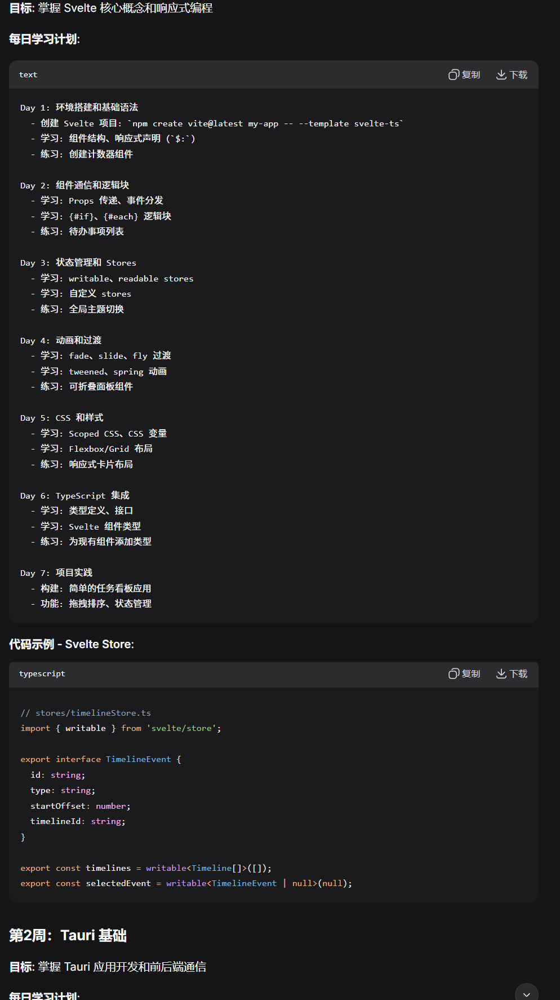
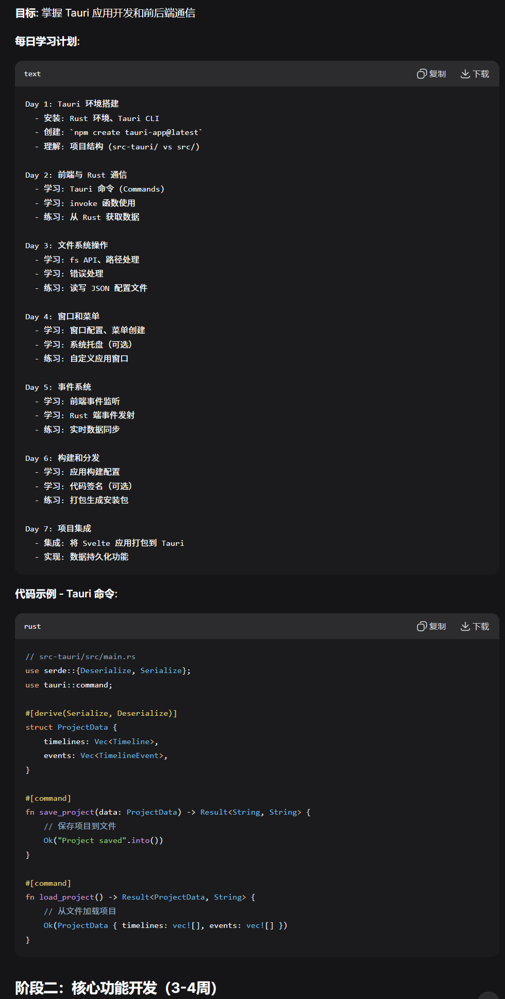
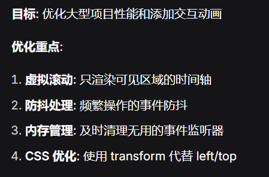
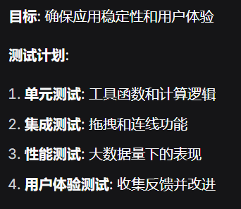
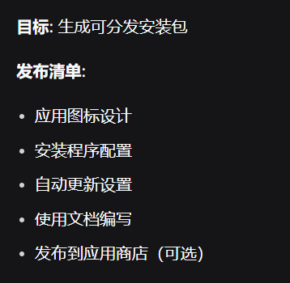

## 一、技术栈选择

#### 阶段一：功能实现

- 前端：Svelte + TypeScript + CSS

- 拖拽：HTML5 Drag API

- 图形：SVG（连线动画）

- 后端：Tauri + Rust （文件存储）

- 构建：Vite

#### 阶段二：更新实现

#### 阶段三：网页拓展

## 二、学习路线

### 1、Svelte基础

### 2、Tauri基础（Tauri，Svelte，TypeScript）

## 三、开发流程（参考）

### I 核心功能开发

#### 1、拖拽系统实现

1. HTML5 Drag API基础
2. 模板面板组件
3. 时间轴和放置区域

#### 2、事件交互和连线系统

目标：实现事件选择和箭头连线功能

1. 事件组件和选择逻辑
2. SVG连线系统
3. 连线动画和交互优化

#### 3、数据持久化和高级功能

目标：实现项目保存加载和用户体验优化

1. Rust后端数据管理
2. 前端项目管理界面
3. 网络系统和吸附功能

### II 优化和发布

#### 1、性能优化和动画

#### 2、测试和调试

#### 3、打包和发布

## 四、学习资源推荐

#### 1、必读文档

- [Svelte 官方教程](https://svelte.dev/tutorial/basics)
- [Tauri 官方指南](https://tauri.app/zh-cn/v1/guides/)
- [HTML5 Drag and Drop API](https://developer.mozilla.org/en-US/docs/Web/API/HTML_Drag_and_Drop_API)

#### 2、参考项目

- 在 GitHub 搜索 "svelte gantt"、"tauri drag drop" 参考实现
- 学习优秀的拖拽交互设计模式

#### 3、调试工具

- 浏览器开发者工具
- Tauri 开发工具
- Rust 调试器

