## 环境部署

### 一、创建新环境（conda）

#### 1. 创建虚拟环境

进入Anaconda Prompt后创建新的虚拟环境，环境名为rtdenv(可自定义)

``` 
conda create -n rtdenv python=3.11
```

#### 2. 进入虚拟环境

```
conda activate rtdenv
```

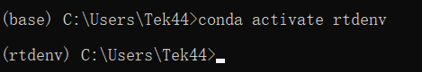


### 二、根据cuda版本与python版本下载pytorch

#### 1. 查看cuda版本（A卡可跳过安装cuda与cudnn步骤）

桌面右键打开NVIDIA控制面板，根据图示顺序点击查看cuda版本（系统信息->组件）

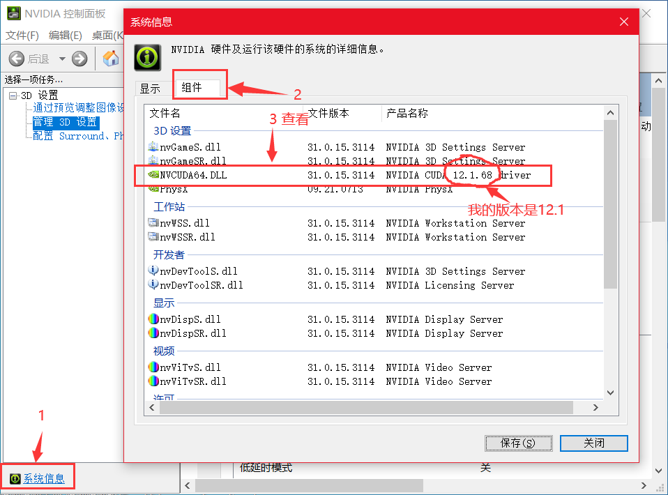

> 也可以在cmd中输入nvidia-smi查看
>
> 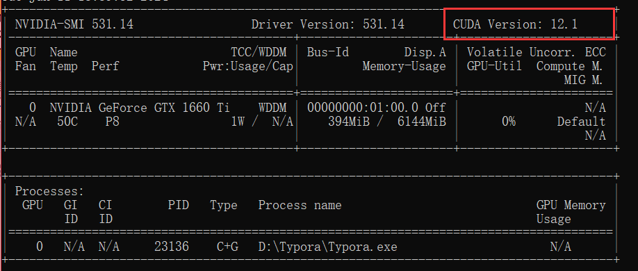


#### 2. 如果无cuda，安装cuda（上一步中检查有cuda可跳过此步）

##### (1) <u>安装显卡驱动</u>

进入nvidia官网https://www.nvidia.cn/Download/index.aspx?lang=cn，根据显卡版本选择下载对应驱动并安装


- 安装完毕后可在cmd输入nvidia -smi检查

##### (2) <u>下载cuda</u>

CUDA下载地址：https://developer.nvidia.com/cuda-toolkit-archive

- 进入网址后选择CUDA版本，此处以选择12.1.1版本为例(可以安装更低如11.8)

- 选择参数并开始下载

  > 因为安装包过大邮件无法发送，故这里没有提供已下载文件
  
  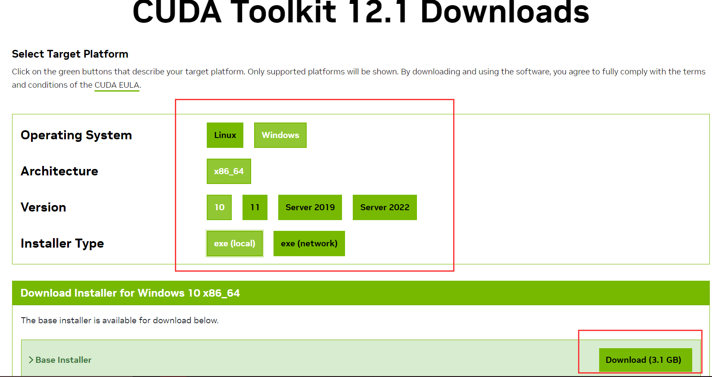

- 下载完获得文件：cuda_12.1.1_531.14_windows.exe

  执行该文件进行安装，安装中的自定义安装选项可全勾选，注意要记住安装目录位置。

##### (3) <u>cuda安装完毕后设置环境变量</u>

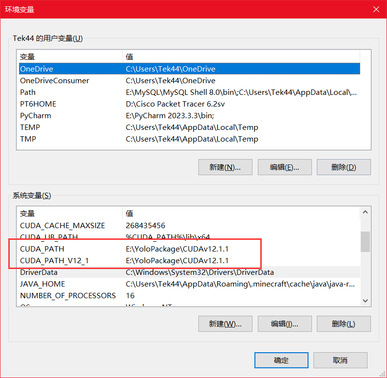

> 此处我在安装时选择了自定义目录，环境变量中选择的CUDAv12.1.1目录如下
>
> 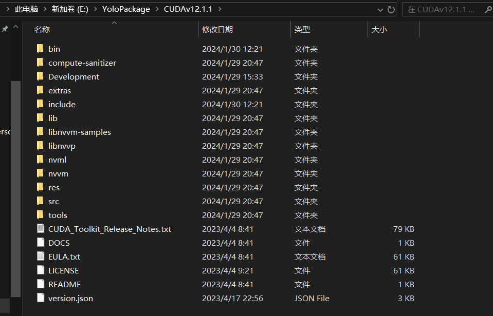


#### 3. 安装cudnn

cudnn下载地址: https://developer.nvidia.com/rdp/cudnn-archive

##### (1) <u>根据cuda版本选择下载版本</u>，此处以选择8.9.0的cuda12.X版本为例（注意此处需要登录nvidia账号才可下载，可以直接注册新账号登录）

> env-build文件夹中提供了已下载的文件，如果与演示版本一致可以直接使用安装，跳过登录下载。
>
> 文件名: cudnn-windows-x86_64-8.9.0.131_cuda12-arcnive.zip

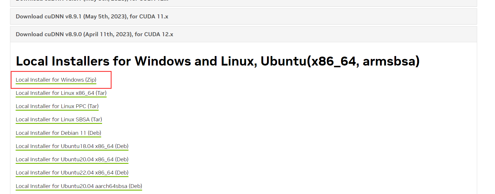

- 下载后得到文件: cudnn-windows-x86_64-8.9.0.131_cuda12-arcnive.zip

##### (2) <u>安装cudnn文件</u>

打开刚才下载的zip压缩包，然后将bin, include, lib中的文件复制粘贴到cuda的文件夹下(既环境变量中设置的文件夹)

注意：对整个文件夹bin, include, lib选中后进行复制粘贴


#### 4. CUDA安装测试

最后测试cuda是否配置成功：

打开CMD执行`nvcc -V`   ，即可看到cuda的信息


#### 5. 虚拟环境中安装pytorch（A卡Compute PlatForm选项选择CPU）

##### (1) 官网获取下载命令

地址：https://pytorch.org/get-started/locally/

根据下载版本选择对应的选项，下方获取命令

> 如果与演示版本一致可以直接使用以下命令安装:
>
> ```
> conda install pytorch torchvision torchaudio pytorch-cuda=12.1 -c pytorch -c nvidia
> ```

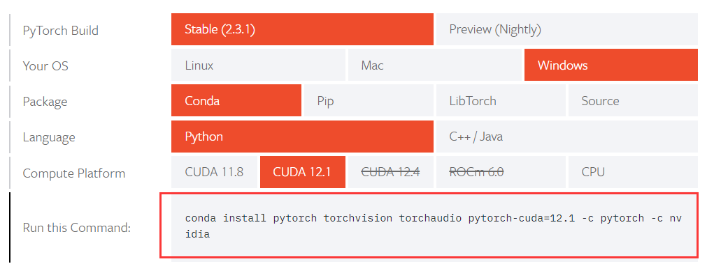

获取命令：

```
   conda install pytorch torchvision torchaudio pytorch-cuda=12.1 -c pytorch -c nvidia
```

   

##### (2) 将获取的命令输入在虚拟环境中运行完成pytorch的安装

   <u>注意已切换至新建立的虚拟环境！</u>

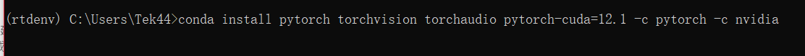

等待一段时间即完成安装

   

### 三、虚拟环境中下载其余包

虚拟环境安装完pytorch后即可安装其他包，其目录在`env-bulid/requirements.txt`中

#### 1. 在虚拟环境中进入env-bulid文件夹

   <u>注意已切换至新建立的虚拟环境！</u>

```
cd /d（env-bulid文件夹的绝对路径）
```

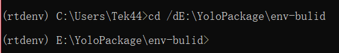

  

#### 2. 批量安装其余包

```py
pip install -r requirements.txt
```

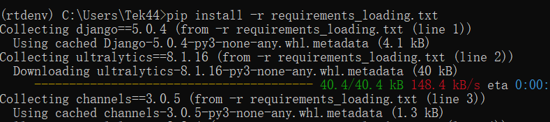

   等待一段时间即完成安装

   

## 配置调整

准备：

- 上述步骤建立的环境命令台进入Real_Time_DetectWEB文件夹（manage.py同目录）

  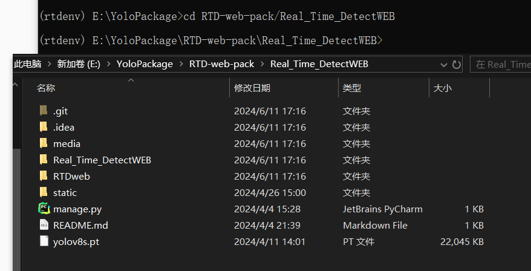

- Pycharm或其他方式打开项目代码准备修改部分配置（Real_Time_DetectWEB即为项目文件夹）

- 准备mysql


### 一、数据库配置

#### 1. 新建mysql数据库（Navicat演示）

任意新建数据库，并记录下数据库的用户名，密码，端口

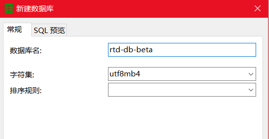

#### 2. 打开项目代码，更改数据库设置

找到`Real_Time_DetectWEB/Real_Time_DetectWEB/settings.py`文件修改其中的数据库四项配置内容


<u>修改示范</u>：

#### 3. 初始化数据库

conda命令台中执行以下命令，完成数据库表的初始化创建

```cmd
python manage.py makemigrations   #一步
python manage.py migrate		  #二步
```

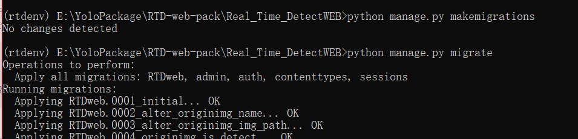


### 二、运行程序

配置完毕后即可运行程序，conda命令台中执行如下指令或者使用编译器运行项目

```cmd
python manage.py runserver
```

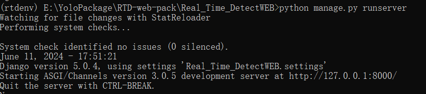

加载结束进入http://127.0.0.1:8000/打开网页。

- CTRL+BREAK可终止程序

> 注意事项：
>
> 视频监测与实时监测功能需要提供监测模型，可以上传提供的预训练模型`yolov8s.pt`，其位置与本word同目录。